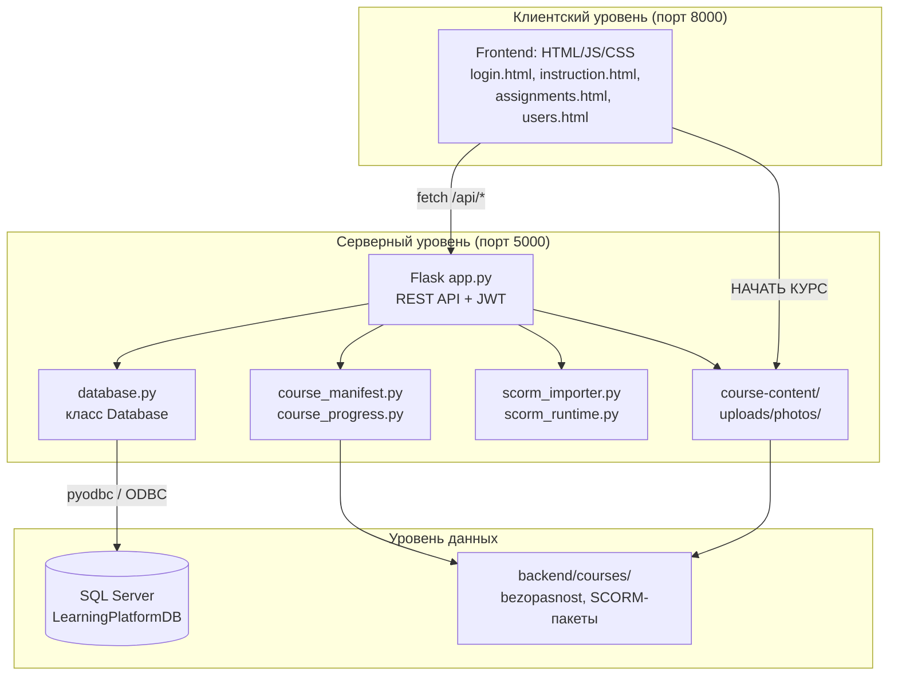
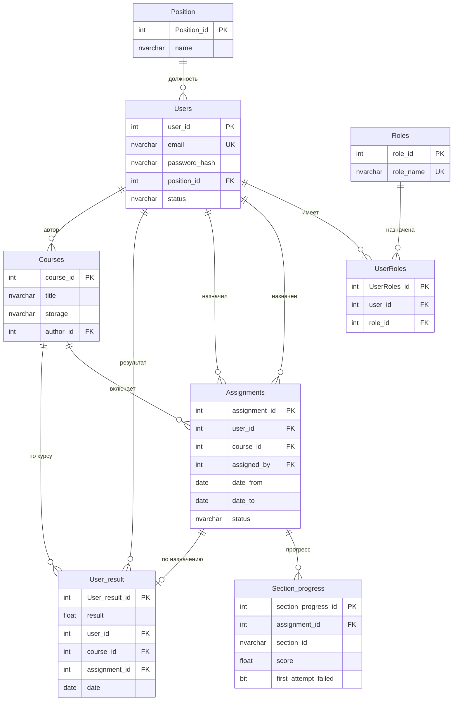
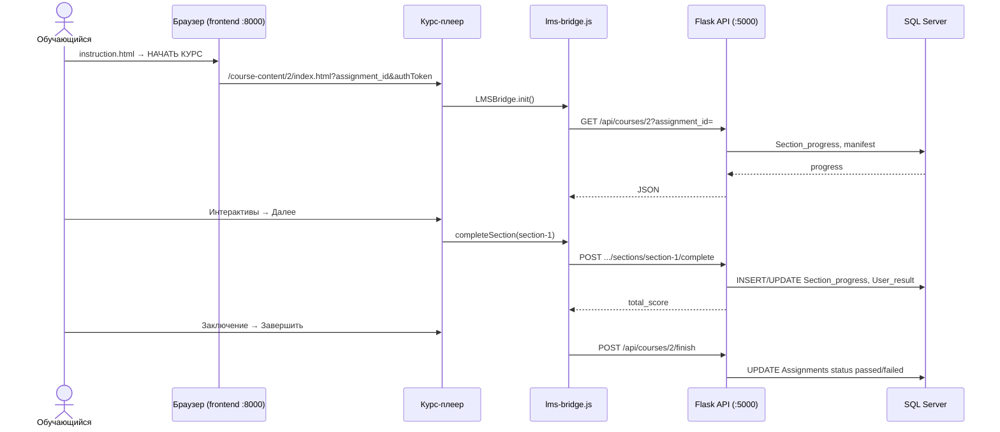
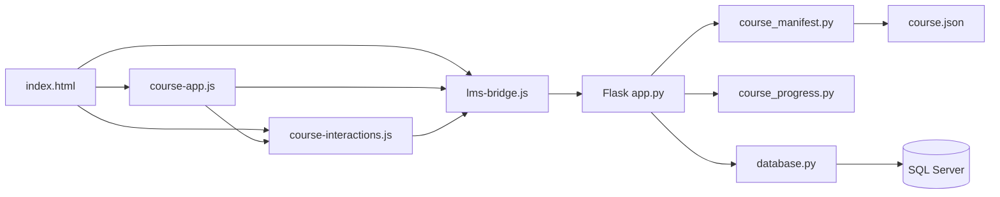
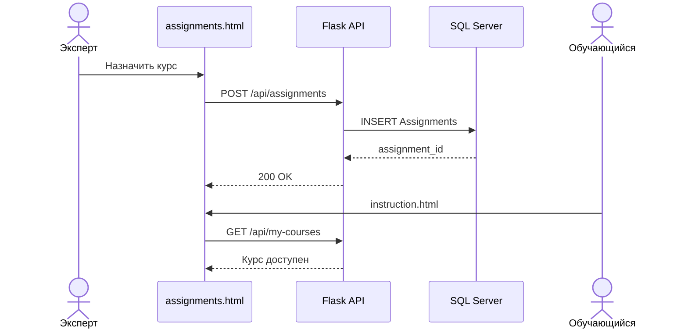

# Глава 2. Реализация физической модели

Реализация физической модели определяет сущности, атрибуты, связи, ограничения целостности в терминах СУБД и создание базы данных для автоматизированной информационной системы.

Для реализации базы данных АИС «Адаптационный курс для сотрудников ритуальной компании» (платформа электронного обучения LMS) использовалось следующее программное обеспечение:

- Visual Studio Code / Cursor — среда разработки и редактирования исходного кода;
- SQL Server Management Studio (SSMS) — проектирование и администрирование базы данных `LearningPlatformDB`;
- Microsoft SQL Server (Express / Developer) — сервер управления данными;
- ODBC Driver 17 for SQL Server — драйвер подключения приложения к СУБД;
- Google Chrome / Microsoft Edge — тестирование веб-интерфейса и курса-плеера.

При разработке программного продукта был использован язык программирования **Python 3.10+**.

Python — высокоуровневый интерпретируемый язык с динамической типизацией, широко применяемый для веб-разработки и интеграции с базами данных. На стороне сервера используется микрофреймворк **Flask** (REST API, JWT-авторизация, раздача файлов курсов), клиентская часть реализована на **HTML5, CSS3 и JavaScript** без сборщика (статический frontend). Такой стек позволяет разделить интерфейс LMS (порт 8000) и backend-сервис (порт 5000), что упрощает развёртывание учебного проекта и поддержку двух типов курсов — нативного («Безопасность») и SCORM 2004.

---

## Архитектура системы

Платформа построена по клиент-серверной схеме «тонкий клиент — REST API — СУБД — файловое хранилище курсов».



**Роли пользователей** и их стартовые страницы после входа:

| Роль | Назначение | Стартовая страница |
|------|------------|-------------------|
| Администратор | Управление пользователями и каталогом курсов | `users.html` |
| Эксперт | Назначение обучения, рейтинг, отчёты Excel | `assignments.html` |
| Обучающийся | Прохождение назначенных курсов, рейтинг | `instruction.html` |

Аутентификация выполняется через endpoint `POST /api/login`: при успешной проверке email и пароля в таблице `Users` сервер выдаёт JWT-токен (срок действия 12 часов). Все защищённые запросы передают заголовок `Authorization: Bearer <token>`. Проверка прав реализована в `app.py` по полю `role` из payload токена (`admin`, `expert`, `student`).

---

## Физическая модель базы данных

На основе диаграммы ER (см. Приложение Е) были разработаны следующие таблицы базы данных:

- **Users** (Учётные записи сотрудников) — (Таблица 6);
- **Courses** (Каталог электронных курсов) — (Таблица 7);
- **Assignments** (Назначения учебных курсов) — (Таблица 8);
- **Section_progress** (Пошаговый прогресс по разделам) — (Таблица 9);
- **User_result** (Результат пользователя) — (Таблица 10);
- **Position** (Должность) — (Таблица 11);
- **Roles** (Роли) — (Таблица 12);
- **UserRoles** (Связь пользователей и ролей) — (Таблица 13).

> Таблица **Feedback** присутствует в учебном шаблоне БД, но в текущей реализации LMS **не используется**. Сущности «Модули», «Квизы», «Вопросы» **не выделены в отдельные таблицы**: структура курса хранится в файлах (`course.json` для нативного курса, `imsmanifest.xml` для SCORM), а прогресс фиксируется в `Section_progress` по идентификатору раздела `section_id`.

### Таблица 6 – Поля таблицы «Пользователи»

**Users**

| Ключ | Имя поля | Тип данных | Обязательный к заполнению |
|------|----------|------------|---------------------------|
| PK | user_id | INTEGER | Y |
| | name | NVARCHAR(25) | Y |
| | surname | NVARCHAR(25) | Y |
| | patronymic | NVARCHAR(25) | N |
| | birthday | DATE | N |
| | phone | NVARCHAR(20) | N |
| | status | NVARCHAR(20) | Y |
| FK | position_id | INTEGER | N |
| | email | NVARCHAR(50) | Y |
| | password_hash | NVARCHAR(256) | Y |
| | photo | NVARCHAR(50) | N |

### Таблица 7 – Поля таблицы «Курсы»

**Courses**

| Ключ | Имя поля | Тип данных | Обязательный к заполнению |
|------|----------|------------|---------------------------|
| PK | course_id | INTEGER | Y |
| | title | NVARCHAR(255) | Y |
| | description | NVARCHAR(MAX) | N |
| FK | author_id | INTEGER | Y |
| | date | DATETIME2(7) | Y |
| | storage | NVARCHAR(MAX) | N |

Поле `storage` содержит имя подпапки в `backend/courses/`, где лежат файлы курса (например, `bezopasnost`).

### Таблица 8 – Поля таблицы «Назначения»

**Assignments**

| Ключ | Имя поля | Тип данных | Обязательный к заполнению |
|------|----------|------------|---------------------------|
| PK | assignment_id | INTEGER | Y |
| FK | user_id | INTEGER | Y |
| FK | course_id | INTEGER | Y |
| FK | assigned_by | INTEGER | Y |
| | date_from | DATE | Y |
| | date_to | DATE | Y |
| | status | NVARCHAR(20) | Y |
| | assigned_at | DATETIME2(7) | Y |

Допустимые значения `status`: `active` (курс в процессе), `passed` (завершён с результатом ≥ 70 %), `failed` (завершён с результатом &lt; 70 %). На одного обучающегося по одному курсу может существовать только одно активное назначение.

### Таблица 9 – Поля таблицы «Прогресс по разделам»

**Section_progress**

| Ключ | Имя поля | Тип данных | Обязательный к заполнению |
|------|----------|------------|---------------------------|
| PK | section_progress_id | INTEGER | Y |
| FK | assignment_id | INTEGER | Y |
| | section_id | NVARCHAR(50) | Y |
| | score | FLOAT | Y |
| | first_attempt_failed | BIT | Y |
| | updated_at | DATETIME2(7) | Y |

Уникальный индекс `UQ_Section_progress (assignment_id, section_id)` не допускает дублирования записи по одному разделу в рамках назначения.

### Таблица 10 – Поля таблицы «Результаты пользователя»

**User_result**

| Ключ | Имя поля | Тип данных | Обязательный к заполнению |
|------|----------|------------|---------------------------|
| PK | User_result_id | INTEGER | Y |
| | result | FLOAT | N |
| FK | user_id | INTEGER | Y |
| FK | course_id | INTEGER | Y |
| | date | DATE | Y |
| FK | assignment_id | INTEGER | N |

Итоговый балл `result` пересчитывается как сумма `score` из `Section_progress` (максимум 100). Порог успешного прохождения — **70 %** (`PASS_THRESHOLD` в `course_progress.py`).

### Таблица 11 – Поля таблицы «Должность»

**Position**

| Ключ | Имя поля | Тип данных | Обязательный к заполнению |
|------|----------|------------|---------------------------|
| PK | Position_id | INTEGER | Y |
| | name | NVARCHAR(15) | Y |

### Таблица 12 – Поля таблицы «Роль»

**Roles**

| Ключ | Имя поля | Тип данных | Обязательный к заполнению |
|------|----------|------------|---------------------------|
| PK | role_id | INTEGER | Y |
| | role_name | NVARCHAR(20) | Y |

### Таблица 13 – Поля таблицы «Связь пользователей и ролей»

**UserRoles**

| Ключ | Имя поля | Тип данных | Обязательный к заполнению |
|------|----------|------------|---------------------------|
| PK | UserRoles_id | INTEGER | Y |
| FK | user_id | INTEGER | Y |
| FK | role_id | INTEGER | Y |

---

На основе полученной на этапе проектирования ERD-модели была разработана база данных с помощью средств MS SQL Server. Актуальный скрипт `backend/LearningPlatformDB.sql` создаёт базу `LearningPlatformDB`, все таблицы, внешние ключи и начальные данные; для обновления существующей БД используется `backend/migration.sql`. Логическая схема представлена в **Приложении Е**; физическая ER-диаграмма приведена ниже.

**Рисунок 5 – Модель базы данных**



Для организации связи между пользователями и ролевыми политиками используются таблицы **Roles** (содержащая жёстко зафиксированные идентификаторы ролей: **4 – Администратор**, **2 – Эксперт**, **3 – Обучающийся**) и связующая таблица **UserRoles**, предотвращающая появление дублирующих ролевых назначений для одного физического лица за счёт наложения уникального индекса `UQ (user_id, role_id)`. Физическая целостность данных поддерживается на уровне СУБД с помощью ограничений ссылочной целостности для связанных внешними ключами таблиц прогресса и результатов. В качестве драйвера соединения приложения с СУБД MS SQL Server на стороне backend-сервера используется стандартизированный интерфейс **ODBC** (библиотека `pyodbc`, строка подключения в `config.py`).

При первом запуске backend вызывается метод `ensure_schema()` класса `Database`: он добавляет недостающие столбцы (`birthday`, `phone`, `status` в `Users`; `assignment_id` в `User_result`) и создаёт таблицы `Assignments` и `Section_progress`, если они отсутствуют после миграции.

---

## Класс доступа к данным

После создания физической модели необходимо реализовать возможность работы с базой данных через приложение. Для этого был создан отдельный класс **Database** в модуле `backend/database.py`, в котором реализовано подключение к СУБД, выполнение SQL-запросов и бизнес-операции LMS.

**Рисунок 6 – Класс Database (фрагмент подключения и запросов)**

```python
class Database:

    def __init__(self):
        self.conn_string = DB_CONNECTION_STRING

    def _get_connection(self):
        return pyodbc.connect(self.conn_string)

    def _query(self, sql, params=(), fetch_one=False, commit=False):
        conn = self._get_connection()
        with conn.cursor() as cursor:
            cursor.execute(sql, params)
            if commit:
                conn.commit()
                return True
            if fetch_one:
                return cursor.fetchone()
            return cursor.fetchall()
```

Класс `Database` инкапсулирует:

- **аутентификацию** — `authenticate_user()`, `get_auth_session()`, `get_user_role()`;
- **управление пользователями** — `get_all_users()`, `create_user()`, `update_admin_user()`, `delete_user()`;
- **каталог курсов** — `get_all_courses()`, `create_course()`, `update_course()`, `delete_course()`;
- **назначения и прогресс** — `create_assignment()`, `get_courses_for_user()`, `complete_section()`, `finish_course()`, `_recalculate_assignment_score()`;
- **аналитику** — `get_rating()`, `get_report_data()`.

Расчёт баллов вынесен в отдельный модуль `course_progress.py` (чистые функции без обращения к БД), что упрощает модульное тестирование (`test_course_progress.py`).

---

## REST API серверной части

Модуль `backend/app.py` регистрирует REST-маршруты и связывает HTTP-запросы с методами класса `Database`. Основные группы endpoint'ов:

| Группа | Метод и путь | Назначение | Роли |
|--------|--------------|------------|------|
| Авторизация | `POST /api/login` | Вход, выдача JWT | все |
| Профиль | `GET/PUT /api/profile` | Личные данные обучающегося | student, admin |
| Курсы обучающегося | `GET /api/my-courses` | Список назначенных курсов | student |
| Запуск курса | `GET /api/courses/<id>` | Манифест, launch_url, прогресс | student |
| Прогресс native | `POST /api/courses/<id>/sections/<section_id>/complete` | Завершение раздела | student |
| Завершение курса | `POST /api/courses/<id>/finish` | Финализация назначения | student |
| SCORM | `GET/POST /api/scorm/<id>/state` | CMI-состояние SCORM 2004 | student |
| Назначения | `POST /api/assignments` | Создание назначения | expert, admin |
| Рейтинг | `GET /api/rating` | Таблица лидеров | все авторизованные |
| Отчёт | `GET /api/report` | Excel-файл `course_report.xlsx` | expert, admin |
| Администрирование | `/api/admin/users`, `/api/admin/courses` | CRUD пользователей и курсов | admin |
| Статика | `/course-content/<id>/...` | HTML/JS/CSS курса | по JWT в URL |
| Медиа | `/uploads/photos/`, `/img/` | Фото профиля, иконки рейтинга | публично |

Формирование Excel-отчёта выполняется функцией `create_excel_report()` с использованием библиотек **pandas** и **openpyxl**. Данные для отчёта формирует `get_report_data()` на основе таблицы `Assignments` с присоединением должности, назначившего сотрудника и текущего прогресса.

**Рисунок – Диаграмма последовательностей: прохождение нативного курса**



---

## Руководство по стилю и пользовательский интерфейс

Для реализации автоматизированной информационной системы «Адаптационный курс для сотрудников ритуальной компании» также было составлено руководство по стилю, представленное в **Приложении И**.

Руководство по стилю — это документ, который определяет набор стандартов для написания, форматирования и оформления документов, сайтов или программ. Помимо всего, руководство по стилю ещё и документирует визуальный язык: единая шапка `.app-header`, палитра LMS (`#FFCBA4`, `#FA8072`, `#F4F4F4`), расположение меню аккаунта (☰) под кнопкой на всех формах.

На основе руководства пользователя и технического задания (Приложение Б) были реализованы следующие страницы интерфейса и необходимый для них функционал.

### Форма авторизации

При входе в АИС пользователю предоставляется возможность авторизоваться по email и паролю. Форма авторизации реализована на странице `login.html` (модули `auth.js`, `common.js`).

**Рисунок 7 – Форма авторизации**

После успешного входа система перенаправляет пользователя на стартовую страницу в зависимости от роли: администратор — «Пользователи», эксперт — «Назначения», обучающийся — «Моё обучение».

### Главное окно роли «Эксперт»

Для эксперта доступны страницы **«Назначения»** (`assignments.html`), **«Рейтинг»** (`rating.html`) и **«Моё обучение»** (`instruction.html`). Эксперт назначает курсы сотрудникам, контролирует сроки обучения и формирует отчёты.

**Рисунок 8 – Главное окно роли «Эксперт» (страница «Назначения»)**

Эксперт имеет возможность создавать назначения курсов: выбирает обучающегося, курс из каталога, период `date_from` — `date_to` и отправляет запрос `POST /api/assignments`. Система проверяет отсутствие дублирующего активного назначения по паре (user_id, course_id).

### Окно добавления курса (роль «Администратор»)

**Рисунок 9 – Окно добавления курса**

На странице `admin-courses.html` администратор может загрузить новый курс: указать название, описание, при необходимости прикрепить ZIP-архив (SCORM с `imsmanifest.xml` или нативный пакет). Backend создаёт запись в `Courses`, папку в `backend/courses/<storage>/` и при импорте вызывает `import_course_archive()`.

### Функция поиска

На страницах «Пользователи» и «Курсы» реализована функция поиска. Пользователь вводит запрос в поисковую строку; frontend передаёт параметр `search` в API, backend выполняет фильтрацию по ФИО, email или названию курса.

**Рисунок 10 – Функция поиска по названию**

**Рисунок 11 – Код реализации поиска (фрагмент `database.py`)**

```python
def get_all_users(self, search=None):
    sql = """
        SELECT U.user_id, U.surname, U.name, ...
        FROM Users U
        WHERE 1=1
    """
    if search:
        sql += " AND (U.surname LIKE ? OR U.name LIKE ? OR U.email LIKE ?)"
        pattern = f"%{search}%"
        params.extend([pattern, pattern, pattern])
```

### Страница «Пользователи» (роль «Администратор»)

**Рисунок 12 – Вкладка «Пользователи»**

На странице `users.html` администратор просматривает список сотрудников, добавляет и редактирует учётные записи, назначает роль и должность, загружает фото профиля. Для выбора должности используется справочник `Position` (`GET /api/admin/positions`), для роли — `Roles` (`GET /api/admin/roles`).

**Рисунок 13 – Код реализации функции фильтрации и поиска пользователей**

Фильтрация реализована на стороне сервера через параметр `search`; на клиенте таблица обновляется без перезагрузки страницы.

### Формирование отчётов

**Рисунок 14 – Страница «Рейтинг» с функцией «Отчёт»**

Эксперту и администратору на странице `rating.html` доступна кнопка **«Отчёт»**: открывается модальное окно фильтров (сотрудник, курс, период). После подтверждения выполняется `GET /api/report?...`, сервер возвращает файл Excel для скачивания в браузере (в отличие от учебного шаблона с сохранением на диск C:\, файл отдаётся напрямую через HTTP).

**Рисунок 15 – Скачивание сформированного отчёта в браузере**

**Рисунок 16 – Пример отчёта «Результаты прохождения курсов»**

Столбцы отчёта: ФИО, должность, курс, назначивший сотрудник, дата назначения, дедлайн, дата фактического прохождения, вердикт (Успешно / Не сдано / В процессе), процент выполнения.

### Главное окно роли «Администратор» (каталог курсов)

**Рисунок 17 – Главное окно роли «Администратор» (страница «Курсы»)**

Администратор управляет каталогом: редактирование метаданных (`PUT /api/admin/courses/<id>`), скачивание архива курса (`GET .../download`), удаление курса с очисткой файлов и связанных записей в БД (`purge_course_data()`).

### Страница «Моё обучение» (роль «Обучающийся»)

**Рисунок 18 – Страница «Моё обучение»**

На странице `instruction.html` обучающийся выбирает назначенный курс из выпадающего списка, видит описание, период обучения, тип курса (Электронный / SCORM 2004) и прогресс в процентах. Кнопка **«НАЧАТЬ КУРС»** активна только при наличии активного назначения и файлов курса на сервере.

**Рисунок 19 – Карточка курса и запуск обучения**

При нажатии «НАЧАТЬ КУРС» выполняется запрос `GET /api/courses/<course_id>?assignment_id=...`; backend возвращает `launch_url`, после чего браузер открывает курс на порту 5000 с параметрами `assignment_id`, `authToken`, `returnUrl`.

**Рисунок 20 – Фрагмент кода реализации назначения курса (`create_assignment`)**

```python
def create_assignment(self, user_id, course_id, assigned_by, date_from, date_to):
    active = self.get_active_assignment(user_id, course_id)
    if active:
        return None, 'У пользователя уже есть активное назначение по этому курсу'
    sql = """
        INSERT INTO Assignments (user_id, course_id, assigned_by, date_from, date_to, status)
        OUTPUT INSERTED.assignment_id
        VALUES (?, ?, ?, ?, ?, 'active')
    """
    assignment_id = self._execute_scalar(sql, (...))
    return assignment_id, None
```

Аналогичные операции добавления и редактирования данных реализованы на странице **«Пользователи»** для учётных записей сотрудников.

---

## Реализация электронного курса «Безопасность»

Ключевой учебный контент системы — нативный адаптационный курс **«Правила использования ИТ-ресурсов»** (`course_id = 2`, папка `backend/courses/bezopasnost/`). Курс реализован как одностраничное приложение (SPA) без SCORM: взаимодействие с LMS выполняется через JavaScript-мост `lms-bridge.js` и REST API.

### Структура курса-плеера

| Компонент | Файл | Назначение |
|-----------|------|------------|
| Разметка и экраны | `index.html` | 10 экранов: обложка, навигация, введение, 6 разделов, заключение |
| Манифест | `course.json` | Разделы, типы, `course_type: native`, точка входа |
| Навигация | `course-app.js` | Переключение экранов, gating кнопки «Далее», содержание |
| Интерактивы | `course-interactions.js` | Квизы, flip-cards, слайдеры, drag-and-drop |
| Интеграция LMS | `lms-bridge.js` | JWT, manifest, complete, finish, exit |
| Стили | `assets/*.css` | Оболочка плеера и оформление разделов |

Оцениваемые разделы — **section-1 … section-6** (6 штук). Вес одного раздела: `section_weight = 100 / 6 ≈ 16,67` балла. Неоцениваемые экраны (`splash`, `navigation`, `intro`, `conclusion`) фиксируются в `Section_progress` с нулевым баллом для учёта прохождения, но не влияют на сумму.

### Механизм gating (блокировки навигации)

Переход «Далее» заблокирован, пока обучающийся не выполнит все интерактивы текущего экрана. Логика реализована декларативно через HTML-атрибуты (`data-quiz`, `data-flip`, `data-slider`, `data-drag-drop`, `data-gated-by*`) и проверку `CourseInteractions.isGateReady()`. При практическом задании, решённом не с первой попытки, начисляется половина баллов раздела (`calculate_section_score()`).

### Связь плеера с backend



После завершения всех оцениваемых разделов на экране «Заключение» вызывается `POST /api/courses/2/finish`. Backend проверяет количество пройденных scorable-разделов, пересчитывает итог, обновляет `Assignments.status` на `passed` или `failed` и очищает временный прогресс (`Section_progress`, SCORM state при необходимости).

---

## Поддержка SCORM-курсов

Помимо нативного курса система поддерживает загрузку **SCORM 2004** пакетов. Администратор загружает ZIP через `admin-courses.html`; модуль `scorm_importer.py` распаковывает архив и определяет тип по наличию `imsmanifest.xml`. Запуск выполняется через `player.html` и API SCORM Runtime:

- `GET/POST /api/scorm/<course_id>/state` — сохранение CMI-данных в `backend/uploads/scorm_state/<assignment_id>.json`;
- `sync_scorm_progress()` — синхронизация баллов с `Section_progress` и `User_result`.

Статические ресурсы SCORM API (`scorm-again`, обёртки) отдаются по маршруту `/scorm-static/`.

**Рисунок – Диаграмма последовательностей: назначение курса экспертом**



---

## Итоги реализации

В результате выполнения второй главы курсовой работы:

1. Развёрнута реляционная база данных **LearningPlatformDB** из **восьми используемых таблиц** с описанием полей и связей.
2. Реализован backend на **Flask** с JWT-авторизацией, REST API и классом **Database** для доступа к данным через **ODBC**.
3. Создан веб-интерфейс LMS для трёх ролей (страницы frontend на порту 8000).
4. Интегрирован нативный курс **«Безопасность»** с пошаговым сохранением прогресса в **Section_progress** и итоговыми результатами в **User_result**.
5. Обеспечена поддержка **SCORM 2004**, формирование **рейтинга** и **Excel-отчётов**.

Физическая модель данных и программная реализация соответствуют проектной документации (приложения А–И) и техническому описанию курса «Безопасность». Тестирование функционала выполняется по документу «Тест-кейсы» и модульным тестам `test_course_progress.py`.

---

*Документ подготовлен для пояснительной записки. Рисунки 7–20 подлежат замене скриншотами интерфейса при вёрстке итогового документа Word. Диаграммы Mermaid экспортируются в PNG для вставки в пояснительную записку (см. инструкции в приложениях Г, Е, З).*
