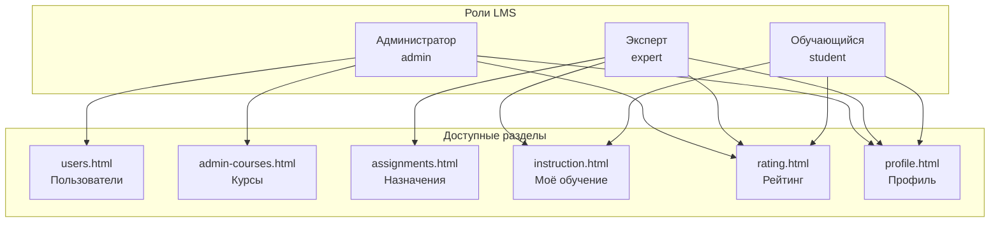

# Глава 3. Организация безопасности АИС

Угрозой безопасности информационной системы являются действия, направленные на изменение, нарушение конфиденциальности, целостности и доступности информации либо несанкционированное использование информации, которая хранится, передаётся или обрабатывается в информационной системе, а также аппаратных и программных средств. Исходя из вышеперечисленного, существует необходимость принять комплекс мер по обеспечению безопасности АИС. Первоначальным шагом к обеспечению безопасности АИС является выявление потенциальных угроз, которым может подвергаться информационная система. В ходе анализа АИС «Адаптационный курс для сотрудников ритуальной компании» (платформа электронного обучения LMS) были выявлены следующие виды угроз:

- угроза доступности к информационной системе;
- угроза повреждения целостности информационной системы;
- угроза нарушения конфиденциальной информации.

Под **угрозой доступности** к информационной системе подразумевается осуществление действий, делающих невозможным или затрудняющих доступ к ресурсам (информации) информационной системы. Для веб-приложения LMS это включает недоступность backend-сервера Flask (порт 5000), frontend (порт 8000), СУБД SQL Server или файлового хранилища курсов в `backend/courses/`, что блокирует назначение и прохождение обучения.

**Повреждение целостности** информационной системы понимается как изменение или полное удаление каких-либо данных, что может привести к неправильной либо невозможной работе с системой. В LMS целостность затрагивает таблицы `Users`, `Assignments`, `Section_progress`, `User_result` и файлы курсов (`course.json`, SCORM-пакеты). Несанкционированное изменение баллов в `Section_progress` или статуса назначения в `Assignments` искажает результаты адаптационного обучения.

Под **угрозами конфиденциальной информации** принято понимать потенциальные или реально возможные действия по отношению к информационным ресурсам, приводящие к неправомерному овладению охраняемыми сведениями: персональными данными сотрудников (ФИО, email, телефон, дата рождения), учётными записями, JWT-токенами сессии, содержимым SCORM state в `backend/uploads/scorm_state/`.

Для определения защитных мер были выявлены конкретные уязвимости в безопасности АИС:

- доступ любого пользователя к функционалу системы без ограничений по ролям;
- возможность доступа любого пользователя операционной системы к файлам информационной системы (курсы, фото профилей, SCORM state);
- получение доступа к информационной системе путём использования компьютера авторизованного пользователя (активная сессия JWT в `sessionStorage`);
- возможное повреждение или несанкционированное изменение базы данных `LearningPlatformDB`;
- передача учётных данных и токена по незащищённому каналу HTTP в учебной конфигурации (localhost).

В качестве мер для решения данных уязвимостей были предприняты следующие действия:

- **разграничение доступа по ролям** — в системе определены три роли (`admin`, `expert`, `student`); каждая роль имеет собственный набор страниц frontend и проверку прав на backend (`app.py`: `is_admin()`, `is_expert()`, `has_report_access()`); прямой переход на URL чужой роли перенаправляет на стартовую страницу пользователя (см. TC-AUTH-006);
- **авторизация в информационной системе** — endpoint `POST /api/login` проверяет email и пароль в таблице `Users`; без знания учётных данных злоумышленник не получает JWT-токен; неавторизованные запросы к API возвращают код 401 (см. TC-AUTH-005);
- **хранение паролей в зашифрованном виде** — в поле `password_hash` таблицы `Users` сохраняется хеш пароля (алгоритм bcrypt через `werkzeug.security`); при аутентификации выполняется сравнение хеша, а не хранение пароля в открытом виде;
- **ограничение срока действия сессии** — JWT-токен действителен 12 часов (`JWT_ACCESS_TOKEN_EXPIRES`); по истечении срока требуется повторный вход;
- **блокировка неактивных учётных записей** — пользователи со статусом `inactive` не могут авторизоваться (см. TC-ADM-USER-002);
- **защита операций с данными на сервере** — все изменяющие запросы (назначения, прогресс, администрирование) требуют заголовок `Authorization: Bearer <token>` и проверку роли на backend, а не только на клиенте;
- **ограничение доступа к файловой системе** — раздача курсов и фото выполняется через контролируемые маршруты Flask (`/course-content/`, `/uploads/photos/`), а не прямым доступом к диску из браузера.

Стоит отметить, что все средства, описанные выше, не дают полного решения проблем с безопасностью информационной системы в производственной среде (для промышленной эксплуатации потребуются HTTPS, политики резервного копирования, аудит действий администратора), но значительно снижают фактор влияния описанных угроз на работоспособность учебного проекта LMS.

---

## Группы пользователей и разграничение полномочий

В разрабатываемой АИС определены следующие группы пользователей:

- **администратор**;
- **эксперт**;
- **обучающийся**.

Роли хранятся в таблицах `Roles` и `UserRoles` и включаются в payload JWT при входе. Стартовые страницы после авторизации различаются: администратор — `users.html`, эксперт — `assignments.html`, обучающийся — `instruction.html`.

### Возможности пользователей группы «Администратор»

- создание, редактирование и удаление записей таблицы **Users** (страница «Пользователи», `GET/POST/PUT/DELETE /api/admin/users`);
- просмотр и редактирование метаданных курсов в таблице **Courses** (страница «Курсы», `PUT /api/admin/courses/<id>`);
- загрузка SCORM-пакетов и нативных курсов, скачивание архива курса, удаление курса с очисткой файлов и связанных данных (`purge_course_data()`);
- просмотр рейтинга и формирование Excel-отчёта (`GET /api/report`);
- **не может** назначать курсы обучающимся (функция эксперта) и проходить обучение через «Моё обучение».

### Возможности пользователей группы «Эксперт»

- создание назначений в таблице **Assignments** (`POST /api/assignments`) — выбор сотрудника, курса, периода обучения;
- просмотр статистики прохождения и рейтинга с фильтрацией по курсу;
- формирование отчёта **course_report.xlsx** по результатам обучения;
- прохождение назначенных ему курсов как обучающийся (`instruction.html`);
- **не может** управлять учётными записями, загружать и удалять курсы, редактировать профиль через API (`PUT /api/profile` возвращает 403).

### Возможности пользователей группы «Обучающийся»

- просмотр назначенных курсов на странице «Моё обучение»;
- запуск и прохождение нативного курса «Безопасность» и SCORM-курсов с сохранением прогресса в **Section_progress** и итога в **User_result**;
- просмотр личного рейтинга (`rating.html`);
- загрузка фото профиля;
- **не может** назначать курсы, управлять пользователями и курсами, формировать отчёты.

### Таблица 28 – Сводка разграничения доступа по ролям

| Функция | Администратор | Эксперт | Обучающийся |
|---------|:-------------:|:-------:|:-----------:|
| Управление пользователями | да | нет | нет |
| Управление каталогом курсов | да | нет | нет |
| Назначение обучения | нет | да | нет |
| Прохождение курсов | нет | да* | да |
| Рейтинг (просмотр) | да | да | да |
| Excel-отчёт | да | да | нет |
| Редактирование профиля (ФИО, телефон) | нет** | нет | нет*** |

\* Эксперту для прохождения курса требуется активное назначение, как и обучающемуся.  
\*\* Администратор просматривает профиль без формы редактирования.  
\*\*\* Обучающийся может загружать фото; изменение ФИО выполняет администратор.

---

## Связь мер безопасности с тестированием

Реализованные механизмы безопасности проверяются тест-кейсами модуля «Аутентификация и авторизация» (TC-AUTH-001 … TC-AUTH-007) и негативными сценариями профиля (TC-PROF-002). Подробное описание тестовых случаев приведено в [Главе 4](Глава_4_Тестирование_и_проверка_работоспособности.md) и в документе [Тест-кейсы](Тест-кейсы.md).

---

*Документ подготовлен для пояснительной записки курсовой работы. Согласован с [Главой 2. Разработка](Глава_2_Разработка.md) и проектной документацией (приложения А–И).*
