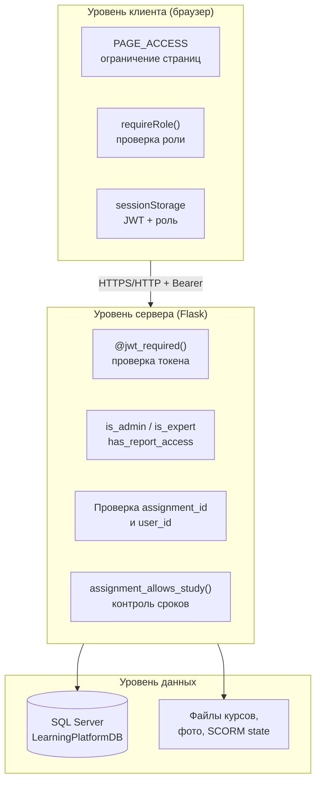
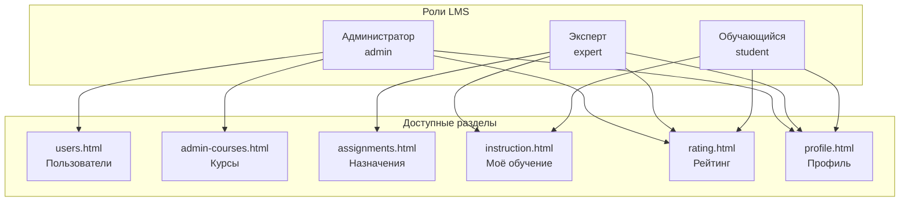

# Глава 3. Организация безопасности АИС

Угрозой безопасности информационной системы являются действия, направленные на изменение, нарушение конфиденциальности, целостности и доступности информации либо несанкционированное использование информации, которая хранится, передаётся или обрабатывается в информационной системе, а также аппаратных и программных средств. Исходя из вышеперечисленного, существует необходимость принять комплекс мер по обеспечению безопасности АИС. Первоначальным шагом к обеспечению безопасности АИС является выявление потенциальных угроз, которым может подвергаться информационная система. В ходе анализа АИС «Адаптационный курс для сотрудников ритуальной компании» (платформа электронного обучения LMS) были выявлены следующие виды угроз:

- угроза доступности к информационной системе;
- угроза повреждения целостности информационной системы;
- угроза нарушения конфиденциальной информации.

Под **угрозой доступности** к информационной системе подразумевается осуществление действий, делающих невозможным или затрудняющих доступ к ресурсам (информации) информационной системы. Для веб-приложения LMS это включает недоступность backend-сервера Flask (порт 5000), frontend-сервера (порт 8000), СУБД Microsoft SQL Server (`LearningPlatformDB`) или файлового хранилища курсов в каталоге `backend/courses/`. При отказе любого из этих компонентов обучающиеся не могут запустить курс, эксперты — назначить обучение, администратор — управлять пользователями и каталогом курсов.

**Повреждение целостности** информационной системы понимается как изменение или полное удаление каких-либо данных, что может привести к неправильной либо невозможной работе с системой. В LMS целостность затрагивает таблицы `Users`, `Roles`, `UserRoles`, `Courses`, `Assignments`, `Section_progress`, `User_result`, а также файлы курсов (`course.json`, SCORM-пакеты) и состояние прохождения SCORM в `backend/uploads/scorm_state/`. Несанкционированное изменение баллов в `Section_progress`, статуса назначения в `Assignments` или метаданных курса в `Courses` искажает результаты адаптационного обучения и подрывает доверие к отчётности.

Под **угрозами конфиденциальной информации** принято понимать потенциальные или реально возможные действия по отношению к информационным ресурсам, приводящие к неправомерному овладению охраняемыми сведениями: персональными данными сотрудников (ФИО, email, телефон, дата рождения, фото), учётными записями, JWT-токенами сессии, содержимым SCORM state, отчётами Excel по результатам обучения.

Для определения защитных мер были выявлены конкретные уязвимости в безопасности АИС:

- доступ любого пользователя к функционалу системы без ограничений по ролям;
- возможность доступа любого пользователя операционной системы к файлам информационной системы (курсы, фото профилей, SCORM state);
- получение доступа к информационной системе путём использования компьютера авторизованного пользователя (активная сессия JWT в `sessionStorage` браузера);
- возможное повреждение или несанкционированное изменение базы данных `LearningPlatformDB`;
- передача учётных данных и токена по незащищённому каналу HTTP в учебной конфигурации (localhost);
- загрузка вредоносных или повреждённых архивов курсов администратором;
- обход ограничений сроков назначения курса и фиксации результатов обучения.

В качестве мер для решения данных уязвимостей были предприняты следующие действия:

- **разграничение доступа по ролям** — в системе определены три роли (`admin`, `expert`, `student`); каждая роль имеет собственный набор страниц frontend и проверку прав на backend;
- **авторизация в информационной системе** — без знания логина и пароля учётной записи злоумышленник не получает JWT-токен и не может вызывать защищённые API;
- **хранение паролей отдельно от интерфейса** — пароль не отображается в клиентском коде и сравнивается только на сервере с полем `password_hash` таблицы `Users`; в интерфейсе администратора пароль вводится только при создании или смене учётной записи;
- **блокировка неактивных учётных записей** — пользователи со статусом `inactive` не проходят аутентификацию;
- **ограничение срока действия сессии** — JWT-токен действителен 12 часов, после чего требуется повторный вход;
- **серверная проверка всех изменяющих операций** — назначения, прогресс, администрирование, SCORM state требуют заголовок `Authorization: Bearer <token>` и проверку роли или владельца назначения;
- **контролируемая раздача файлов** — курсы, фото и SCORM-ресурсы отдаются через маршруты Flask с проверкой пути, а не прямым доступом к диску из браузера;
- **валидация загружаемых файлов** — ограничение форматов фото (PNG, JPG, JPEG, GIF, WEBP, до 50 МБ) и курсов (только ZIP); безопасная распаковка архивов с защитой от path traversal;
- **контроль сроков обучения** — автоматическое закрытие просроченных назначений и блокировка прохождения курса при нарушении дедлайна.

Стоит отметить, что все средства, описанные выше, не дают полного решения проблем с безопасностью информационной системы в производственной среде (для промышленной эксплуатации потребуются HTTPS/TLS, хеширование паролей алгоритмом bcrypt или Argon2, аудит действий администратора, резервное копирование и сегментация сети), но значительно снижают фактор влияния описанных угроз на работоспособность учебного проекта LMS.

---

## Архитектура обеспечения безопасности

Безопасность АИС реализована по многоуровневой схеме: на уровне клиента (браузер), прикладного сервера (Flask), базы данных (SQL Server) и файлового хранилища. Каждый уровень дополняет предыдущий: даже при обходе клиентских ограничений сервер отклоняет несанкционированный запрос.

### Таблица 26 – Уровни защиты и реализующие средства

| Уровень | Угроза | Средство защиты | Реализация в проекте |
|---------|--------|-----------------|----------------------|
| Клиент | Доступ к чужим разделам UI | Разграничение страниц по ролям | `PAGE_ACCESS`, `requireRole()` в `common.js` |
| Клиент | Работа без сессии | Редирект на `login.html` | `requireAuth()`, `ensureAuthSession()` |
| Сервер | Вызов API без токена | JWT-аутентификация | `@jwt_required()`, Flask-JWT-Extended |
| Сервер | Эскалация привилегий | RBAC на endpoint | `is_admin()`, `has_report_access()` в `app.py` |
| Сервер | Чужой прогресс / SCORM | Проверка владельца назначения | `assignment.user_id == user_id` |
| Сервер | Обход дедлайна | Контроль сроков | `assignment_allows_study()`, `expire_overdue_assignments()` |
| Данные | Порча БД | Параметризованные запросы | `pyodbc`, методы класса `Database` |
| Файлы | Path traversal в ZIP | Нормализация пути | `_safe_extract_zip()` в `scorm_importer.py` |
| Файлы | Произвольная загрузка | Валидация MIME/расширения | `validate_photo_upload()`, проверка `.zip` |

---

## Аутентификация и управление сессией

### Механизм входа

Аутентификация выполняется через endpoint `POST /api/login`. Сервер принимает логин (email из таблицы `Users`) и пароль, выполняет проверку в методе `Database.authenticate_user()`:

1. поиск пользователя по email без учёта регистра;
2. сравнение введённого пароля со значением поля `password_hash`;
3. проверка статуса учётной записи — для `inactive` вход запрещён;
4. при успехе — формирование JWT-токена с payload: `user_id`, `role`, `full_name`.

Токен сохраняется в `sessionStorage` браузера (`authToken`) вместе с ролью (`userRole`) и стартовой страницей (`homePage`). Пароль после входа в клиентском коде не хранится.

### Параметры JWT

| Параметр | Значение | Назначение |
|----------|----------|------------|
| `JWT_SECRET_KEY` | секрет из `config.py` | подпись токена |
| `JWT_ACCESS_TOKEN_EXPIRES` | 12 часов | ограничение времени сессии |
| Передача | заголовок `Authorization: Bearer …` | все защищённые API |

При истечении срока действия токена запросы к API возвращают код 401; frontend перенаправляет пользователя на страницу входа.

### Выход из системы

Функция `logout()` в `common.js` очищает `sessionStorage` (токен, роль, ФИО, домашнюю страницу) и выполняет переход на `login.html`, что снижает риск несанкционированного использования оставленной без присмотра рабочей станции.

---

## Авторизация и разграничение полномочий (RBAC)

В разрабатываемой АИС определены следующие группы пользователей:

- **администратор** (`admin`);
- **эксперт** (`expert`);
- **обучающийся** (`student`).

Роли хранятся в таблицах `Roles` и `UserRoles` и включаются в payload JWT при входе. Стартовые страницы после авторизации различаются: администратор — `users.html`, эксперт — `assignments.html`, обучающийся — `instruction.html`.

### Защита на уровне frontend

В файле `common.js` задана матрица `PAGE_ACCESS`, связывающая HTML-страницы с допустимыми ролями. Функция `guardPageAccess()` при загрузке страницы:

- проверяет наличие действующей сессии;
- сравнивает роль пользователя со списком разрешённых для текущей страницы;
- при несоответствии перенаправляет на домашнюю страницу роли.

Таким образом, обучающийся не может открыть `admin-courses.html`, а администратор — `assignments.html`, даже при прямом вводе URL в адресной строке.

### Защита на уровне backend

Все критичные операции дублируют проверку роли на сервере. Примеры:

| Группа endpoint | Проверка | Код при отказе |
|-----------------|----------|----------------|
| `/api/admin/*` | `is_admin(role)` | 403 «Доступ запрещен» |
| `/api/assignments` (POST) | роль `expert` или `admin` | 403 |
| `/api/report` | `has_report_access(role)` — expert, admin | 403 |
| `/api/profile` (PUT) | запрет для expert | 403 |
| Любой `@jwt_required()` | валидный JWT | 401 |

Проверка только на клиенте считается недостаточной: backend является обязательным контуром безопасности.

### Возможности пользователей группы «Администратор»

- создание, редактирование и удаление записей таблицы **Users** (страница «Пользователи», `GET/POST/PUT/DELETE /api/admin/users`);
- загрузка фото сотрудникам (`POST /api/admin/users/<id>/photo`) с валидацией формата и размера;
- просмотр и редактирование метаданных курсов в таблице **Courses** (`PUT /api/admin/courses/<id>`);
- загрузка SCORM-пакетов и нативных курсов, скачивание архива курса, удаление курса с очисткой файлов и связанных данных;
- просмотр рейтинга и формирование Excel-отчёта (`GET /api/report`);
- **не может** назначать курсы обучающимся через интерфейс (функция эксперта) и проходить обучение через «Моё обучение».

### Возможности пользователей группы «Эксперт»

- создание назначений в таблице **Assignments** (`POST /api/assignments`) — выбор сотрудника, курса, периода обучения;
- просмотр расписания назначений (`GET /api/assignments/overview`);
- просмотр статистики прохождения и рейтинга с фильтрацией по курсу;
- формирование отчёта **course_report.xlsx** по результатам обучения;
- прохождение назначенных ему курсов как обучающийся (`instruction.html`);
- **не может** управлять учётными записями, загружать и удалять курсы, редактировать профиль через API.

### Возможности пользователей группы «Обучающийся»

- просмотр назначенных курсов и расписания на странице «Моё обучение»;
- запуск и прохождение нативного курса «Безопасность» и SCORM-курсов с сохранением прогресса в **Section_progress** и итога в **User_result**;
- просмотр личного рейтинга (`rating.html`);
- загрузка фото профиля;
- **не может** назначать курсы, управлять пользователями и курсами, формировать отчёты.

### Таблица 27 – Сводка разграничения доступа по ролям

| Функция | Администратор | Эксперт | Обучающийся |
|---------|:-------------:|:-------:|:-----------:|
| Управление пользователями | да | нет | нет |
| Управление каталогом курсов | да | нет | нет |
| Назначение обучения | нет* | да | нет |
| Прохождение курсов | нет | да** | да |
| Рейтинг (просмотр) | да | да | да |
| Excel-отчёт | да | да | нет |
| Редактирование профиля (ФИО, телефон) | нет*** | нет | нет**** |

\* Назначение курсов в UI предусмотрено только для эксперта; API допускает роль admin, но в меню администратора раздел отсутствует.  
\** Эксперту для прохождения курса требуется активное назначение, как и обучающемуся.  
\*\*\* Администратор просматривает профиль без формы редактирования.  
\*\*\*\* Обучающийся может загружать фото; изменение ФИО выполняет администратор.

---

## Защита целостности данных

### Контроль учебного прогресса

Сохранение баллов и завершения разделов выполняется только через авторизованные endpoint:

- `POST /api/courses/<id>/sections/<section_id>/complete`
- `POST /api/courses/<id>/finish`
- `GET/POST /api/scorm/<id>/state`

Перед записью прогресса сервер проверяет:

1. принадлежность `assignment_id` текущему `user_id`;
2. соответствие `course_id` назначению;
3. допустимость прохождения по срокам (`assignment_allows_study()`).

При нарушении срока назначения система автоматически переводит назначение в статус «не пройден» (`expire_overdue_assignments()`) и блокирует дальнейшее прохождение. Это предотвращает изменение результата после дедлайна.

### Порог успешного прохождения

Итоговый вердикт «пройден / не пройден» определяется на сервере по порогу **70%** (`PASS_THRESHOLD` в `course_progress.py`). Клиентский курс не может самостоятельно зафиксировать успешное завершение без вызова `finish` API.

### Администрирование курсов

При удалении курса вызывается `purge_course_data()`: удаляются записи в `Courses`, `Assignments`, `Section_progress`, `User_result` и каталог курса на диске. Операция доступна только администратору и требует подтверждения в UI, что снижает риск случайной потери данных.

### Параметризованные запросы к БД

Класс `Database` использует параметризованные SQL-запросы через `pyodbc`, что снижает риск SQL-инъекций при работе с логином, поиском пользователей и фильтрами отчётов.

---

## Защита конфиденциальности и файловых ресурсов

### Персональные данные

В таблице `Users` хранятся ФИО, email, телефон, дата рождения, фото, статус учётной записи. Доступ к полному списку пользователей и карточке сотрудника имеет только администратор (`/api/admin/users`). Обучающийся видит в рейтинге только агрегированные баллы, без административных полей чужих профилей.

### Загрузка и хранение фото

Модуль `file_uploads.py` ограничивает загрузку:

- допустимые расширения: PNG, JPG, JPEG, GIF, WEBP;
- максимальный размер: 50 МБ;
- имя файла формируется через `secure_filename()` с префиксом `user_<id>_`.

Фото раздаётся по маршруту `/uploads/photos/<filename>`, а не из произвольного каталога.

### Импорт курсов

При загрузке SCORM/ZIP администратором:

- принимается только расширение `.zip`;
- распаковка выполняется функцией `_safe_extract_zip()` с проверкой, что путь каждого файла внутри архива остаётся внутри целевого каталога (защита от Zip Slip / path traversal);
- повреждённые архивы отклоняются с сообщением «Повреждённый ZIP-архив»;
- архивы без `imsmanifest.xml` и `course.json` не импортируются.

### SCORM state

Состояние прохождения SCORM сохраняется в `backend/uploads/scorm_state/<assignment_id>.json`. Доступ к state возможен только при валидном JWT и совпадении `assignment_id` с текущим пользователем.

### Отчёты Excel

Формирование отчёта `course_report.xlsx` доступно эксперту и администратору. Обучающийся не имеет доступа к endpoint `/api/report`. Отчёт содержит результаты обучения, необходимые для кадрового контроля, и не должен передаваться третьим лицам вне регламента организации.

---

## Защита доступности

Для обеспечения доступности в рамках курсового проекта применяются организационные и программные меры:

| Мера | Описание |
|------|----------|
| Локальное развёртывание | Backend, frontend и SQL Server на одной рабочей станции или в локальной сети организации |
| Раздельные порты | Frontend :8000 и backend :5000 — независимый перезапуск статики и API |
| Проверка файлов курса | `course_has_files()` перед запуском — пользователь получает понятное сообщение вместо «пустой» страницы |
| Обработка ошибок API | Коды 400/401/403/404/500 с текстовым `message` для диагностики без раскрытия стека в UI |
| Trusted Connection | Подключение к SQL Server через Windows-аутентификацию (`Trusted_Connection=yes`) в учебной конфигурации |

При недоступности backend пользователь видит сообщение «Ошибка загрузки»; при остановке SQL Server операции с данными возвращают ошибку БД без повреждения файлов курсов.

---

## Ограничения учебной конфигурации и рекомендации

В текущей версии LMS, разработанной в рамках курсовой работы, сознательно приняты упрощения, которые необходимо устранить перед промышленной эксплуатацией:

| Аспект | Текущее состояние | Рекомендация для эксплуатации |
|--------|-------------------|-------------------------------|
| Транспорт | HTTP на localhost | HTTPS, сертификат TLS |
| Пароли | сравнение с полем `password_hash` в БД | одностороннее хеширование (bcrypt/Argon2) |
| CORS | `origins: "*"` для `/api/*` | whitelist доменов организации |
| JWT secret | константа в `config.py` | переменная окружения, ротация ключей |
| Аудит | не ведётся журнал действий администратора | таблица audit log |
| Резервирование | не автоматизировано | регулярный backup БД и `backend/courses/` |

Данные ограничения не отменяют реализованных механизмов RBAC, JWT, серверной валидации и контроля файлов, но должны быть отражены в пояснительной записке как направление развития системы.

---

## Связь мер безопасности с тестированием

Реализованные механизмы безопасности проверяются тест-кейсами в документе [Тест-кейсы](Тест-кейсы.md):

| Область безопасности | Тест-кейсы |
|----------------------|------------|
| Разграничение ролей на UI | TC-AUTH-006, TC-ADM-UI-001 |
| Блокировка неактивных учётных записей | TC-ADM-USER-002, TC-ADM-USER-004 |
| Валидация данных администратором | TC-ADM-USER-005, TC-ADM-USER-006, TC-ADM-USER-009 |
| Защита каталога курсов | TC-ADM-COURSE-007, TC-ADM-COURSE-008, TC-ADM-COURSE-009, TC-ADM-COURSE-010 |
| Контроль удаления | TC-ADM-COURSE-005, TC-ADM-COURSE-011 |
| Доступ к отчётам | TC-ADM-RPT-001, TC-ADM-RPT-002, TC-RATE-002 |
| Профиль и запрет редактирования | TC-ADM-UI-002, TC-PROF-002 |
| Контроль сроков обучения | TC-ASGN-001, TC-ASGN-002 (модуль назначений) |

Подробное описание тестовых случаев и протокол проведения тестирования приведены в [Главе 4](Глава_4_Тестирование_и_проверка_работоспособности.md).

---

*Документ подготовлен для пояснительной записки курсовой работы по образцу структуры главы 3 из пояснительной записки (ДП Иереева). Согласован с [Главой 2. Разработка](Глава_2_Разработка.md), [Руководством пользователя](Руководство_пользователя.md) и проектной документацией (приложения А–И).*
