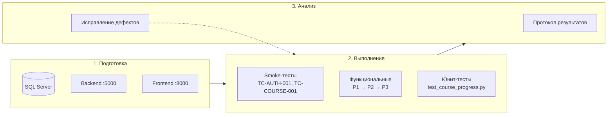

# Глава 4. Тестирование и проверка работоспособности

Для проверки правильной работоспособности приложения необходимо провести тестирование.

**Тестирование** — одна из техник контроля качества, включающая активности по планированию работ, проектированию тестов, выполнению тестирования и анализу полученных результатов.

**Тестирование программного обеспечения** — проверка соответствия между реальным и ожидаемым поведением программы, осуществляемая на конечном наборе тестов, выбранном определённым образом.

В ходе выполнения курсовой работы было проведено **функциональное**, **интеграционное** и **модульное** тестирование платформы электронного обучения «Адаптационный курс для сотрудников ритуальной компании» с помощью **Test-case** (тестовых случаев) и автоматизированных юнит-тестов Python.

**Тестовый случай (Test Case)** — артефакт, описывающий совокупность шагов, конкретных условий и параметров, необходимых для проверки реализации тестируемой функции или её части.

---

## Окружение и методика тестирования

Тестирование выполнялось в следующем окружении:

| Параметр | Значение |
|----------|----------|
| ОС | Windows 10/11 |
| Браузер | Google Chrome / Microsoft Edge (актуальная версия) |
| Frontend | `http://127.0.0.1:8000` (Python `http.server`) |
| Backend | `http://127.0.0.1:5000` (Flask) |
| СУБД | Microsoft SQL Server, база `LearningPlatformDB` |
| Python | 3.10+ |

Полный комплект тест-кейсов с идентификаторами TC-* оформлен в документе [Тест-кейсы](Тест-кейсы.md) (версия 1.3). Ниже приведены шаблон оформления, сводная таблица покрытия и **10 репрезентативных тестовых случаев** (Таблицы 17–25), отражающих ключевые сценарии по всем ролям и модулям LMS, включая проверку мер безопасности из [Главы 3](Глава_3_Организация_безопасности_АИС.md).

---

## Шаблон тестового случая

### Таблица 14 – Шаблон тестового случая

| Id теста | Название теста | Краткое описание теста |
|----------|----------------|------------------------|
| *значение* | *значение* | *значение* |

| Этапы теста: | Ожидаемый результат: | Фактический результат: | Статус (успешно/завершилось ошибкой) |
|--------------|----------------------|------------------------|--------------------------------------|
| *значение* | *значение* | *значение* | *значение* |

### Таблица 15 – Расшифровка шаблона тестового случая

| Поле | Описание |
|------|----------|
| **Id теста** | Уникальный ID для каждого тестового примера |
| **Название теста** | Название тестового случая |
| **Краткое описание теста** | Описание того, что должен достичь тест |
| **Этапы теста:** | Перечисление выполненных этапов для достижения цели пошагово |
| **Ожидаемый результат:** | Описание результата, который должен появиться в конце выполнения необходимых этапов |
| **Фактический результат:** | Описание результата после выполнения необходимых этапов |
| **Статус (успешно/завершилось ошибкой)** | Вывод о том, достигнут ли ожидаемый результат |

---

## Сводная таблица тест-кейсов LMS

### Таблица 16 – Перечень тестовых случаев по модулям

| Id теста | Модуль | Название | Приоритет | Тип | Ссылка |
|----------|--------|----------|-----------|-----|--------|
| TC-AUTH-001 | Аутентификация | Успешная авторизация обучающегося | P1 | F | [Тест-кейсы §2](Тест-кейсы.md) |
| TC-AUTH-002 | Аутентификация | Успешная авторизация эксперта | P1 | F | [Тест-кейсы §2](Тест-кейсы.md) |
| TC-AUTH-003 | Аутентификация | Успешная авторизация администратора | P1 | F | [Тест-кейсы §2](Тест-кейсы.md) |
| TC-AUTH-004 | Аутентификация | Отказ при неверном пароле | P1 | N | [Тест-кейсы §2](Тест-кейсы.md) |
| TC-AUTH-005 | Аутентификация | Редирект неавторизованного пользователя | P1 | S | [Тест-кейсы §2](Тест-кейсы.md) |
| TC-AUTH-006 | Аутентификация | Запрет доступа к чужим страницам | P1 | S | [Тест-кейсы §2](Тест-кейсы.md) |
| TC-AUTH-007 | Аутентификация | Корректный выход из системы | P2 | F | [Тест-кейсы §2](Тест-кейсы.md) |
| TC-ASGN-001 | Назначения | Назначение курса обучающемуся | P1 | F, I | [Тест-кейсы §3](Тест-кейсы.md) |
| TC-ASGN-002 | Назначения | Запрет дублирующего назначения | P2 | N | [Тест-кейсы §3](Тест-кейсы.md) |
| TC-COURSE-001 | Курс | Запуск курса «Безопасность» | P1 | F, I | [Тест-кейсы §4](Тест-кейсы.md) |
| TC-COURSE-002 | Курс | Блокировка «Далее» до интерактивов | P1 | F | [Тест-кейсы §4](Тест-кейсы.md) |
| TC-COURSE-003 | Курс | Успешное прохождение квиза | P1 | F | [Тест-кейсы §4](Тест-кейсы.md) |
| TC-COURSE-005 | Курс | Сохранение прогресса раздела | P1 | I | [Тест-кейсы §4](Тест-кейсы.md) |
| TC-COURSE-006 | Курс | Статус passed/failed (порог 70 %) | P1 | F | [Тест-кейсы §4](Тест-кейсы.md) |
| TC-COURSE-007A | Курс | Выход с сохранением прогресса | P1 | F | [Тест-кейсы §4](Тест-кейсы.md) |
| TC-RATE-001 | Рейтинг | Таблица рейтинга для обучающегося | P2 | UI | [Тест-кейсы §5](Тест-кейсы.md) |
| TC-RATE-002 | Рейтинг | Excel-отчёт экспертом | P2 | F, I | [Тест-кейсы §5](Тест-кейсы.md) |
| TC-ADM-USER-001 | Администрирование | Добавление сотрудника | P1 | F | [Тест-кейсы §6](Тест-кейсы.md) |
| TC-ADM-USER-005 | Администрирование | Создание без обязательных полей | P1 | N | [Тест-кейсы §6](Тест-кейсы.md) |
| TC-ADM-USER-009 | Администрирование | Фото недопустимого формата | P2 | N | [Тест-кейсы §6](Тест-кейсы.md) |
| TC-ADM-COURSE-001 | Администрирование | Редактирование курса | P1 | F | [Тест-кейсы §7](Тест-кейсы.md) |
| TC-ADM-COURSE-007 | Администрирование | ZIP без учебного содержимого | P1 | N | [Тест-кейсы §7](Тест-кейсы.md) |
| TC-ADM-COURSE-004 | Администрирование | Импорт SCORM-пакета | P1 | I | [Тест-кейсы §7](Тест-кейсы.md) |
| TC-ADM-RPT-001 | Безопасность / отчёты | Excel-отчёт администратором | P1 | F, I | [Тест-кейсы §8](Тест-кейсы.md) |
| TC-ADM-UI-001 | Безопасность / UI | Навигация администратора | P2 | UI | [Тест-кейсы §8](Тест-кейсы.md) |
| TC-UI-001 | Интерфейс | Меню аккаунта под кнопкой ☰ | P2 | UI | [Тест-кейсы §8](Тест-кейсы.md) |
| TC-PROF-002 | Профиль | Запрет редактирования экспертом | P2 | N | [Тест-кейсы §9](Тест-кейсы.md) |
| TC-UNIT-001 | Backend | Расчёт баллов course_progress.py | P1 | F | [Тест-кейсы §10](Тест-кейсы.md) |
| TC-UNIT-002 | Backend | Манифест курса bezopasnost | P1 | F | [Тест-кейсы §10](Тест-кейсы.md) |

---

## Результаты функционального тестирования

Ниже представлены детализированные тестовые случаи по образцу учебного шаблона (Таблицы 17–25). Идентификаторы **TC-*** соответствуют полному описанию в [Тест-кейсы.md](Тест-кейсы.md).

### Таблица 17 – Тестовый случай 01 (TC-AUTH-004)

| Id теста | Название теста | Краткое описание теста |
|----------|----------------|------------------------|
| TC-AUTH-004 | Отказ при неверном пароле | Проверка отклонения входа при корректном логине и неверном пароле. Приоритет: P1. Тип: N. |

| Этапы теста: | Ожидаемый результат: | Фактический результат: | Статус |
|--------------|----------------------|------------------------|--------|
| 1. Запустить backend и frontend. 2. Открыть `login.html`. 3. Ввести логин `pkabkov@ra.ru` и пароль `wrongpassword`. 4. Нажать «Войти». | 1. Отображается сообщение об ошибке авторизации. 2. Пользователь остаётся на `login.html`. 3. JWT не создаётся. | Сообщение об ошибке отображается; редиректа нет; в `sessionStorage` отсутствует токен. | Успешно |

### Таблица 18 – Тестовый случай 02 (TC-AUTH-001)

| Id теста | Название теста | Краткое описание теста |
|----------|----------------|------------------------|
| TC-AUTH-001 | Успешная авторизация обучающегося | Проверка входа обучающегося с корректными учётными данными и перехода на стартовую страницу роли. Приоритет: P1. Тип: F. |

| Этапы теста: | Ожидаемый результат: | Фактический результат: | Статус |
|--------------|----------------------|------------------------|--------|
| 1. Запустить проект. 2. Ввести логин `pkabkov@ra.ru`, пароль `petya`. 3. Нажать «Войти». | 1. Авторизация успешна. 2. Редирект на `instruction.html`. 3. JWT сохранён в `sessionStorage`. 4. `userRole = student`. | Редирект на «Моё обучение»; токен и роль сохранены корректно. | Успешно |

### Таблица 19 – Тестовый случай 03 (TC-AUTH-003)

| Id теста | Название теста | Краткое описание теста |
|----------|----------------|------------------------|
| TC-AUTH-003 | Успешная авторизация администратора | Проверка входа администратора и перенаправления на страницу управления пользователями. Приоритет: P1. Тип: F. |

| Этапы теста: | Ожидаемый результат: | Фактический результат: | Статус |
|--------------|----------------------|------------------------|--------|
| 1. Запустить проект. 2. Ввести логин `iereevamaria`, пароль `mariamegaadministrator`. 3. Нажать «Войти». | 1. Авторизация успешна. 2. Редирект на `users.html`. 3. `userRole = admin`. | Открыта страница «Пользователи»; роль администратора определена верно. | Успешно |

### Таблица 20 – Тестовый случай 04 (TC-ASGN-001)

| Id теста | Название теста | Краткое описание теста |
|----------|----------------|------------------------|
| TC-ASGN-001 | Назначение курса обучающемуся | Проверка успешного назначения курса «Безопасность» сотруднику экспертом. Приоритет: P1. Тип: F, I. |

| Этапы теста: | Ожидаемый результат: | Фактический результат: | Статус |
|--------------|----------------------|------------------------|--------|
| 1. Авторизоваться под экспертом (`miereeva@yandex.ru`). 2. Открыть `assignments.html`. 3. Нажать «Назначить курс» на карточке «Безопасность». 4. Выбрать сотрудника `pkabkov@ra.ru`, указать период (+30 дней). 5. Нажать «Назначить →». 6. Войти как студент, открыть «Моё обучение». | 1. API возвращает 200. 2. В `Assignments` создана запись со статусом `active`. 3. У студента отображается курс; кнопка «НАЧАТЬ КУРС» активна. | Назначение создано; курс виден обучающемуся; запуск доступен. | Успешно |

### Таблица 21 – Тестовый случай 05 (TC-ASGN-002)

| Id теста | Название теста | Краткое описание теста |
|----------|----------------|------------------------|
| TC-ASGN-002 | Запрет дублирующего активного назначения | Проверка невозможности создать второе активное назначение по тому же курсу. Приоритет: P2. Тип: N. |

| Этапы теста: | Ожидаемый результат: | Фактический результат: | Статус |
|--------------|----------------------|------------------------|--------|
| 1. Авторизоваться под экспертом. 2. Повторно назначить тот же курс тому же студенту при наличии активного назначения. | 1. API возвращает ошибку. 2. Сообщение: «У пользователя уже есть активное назначение по этому курсу». 3. Дубликат в БД не создаётся. | Ошибка отображается; в таблице `Assignments` одна активная запись. | Успешно |

### Таблица 22 – Тестовый случай 06 (TC-COURSE-005)

| Id теста | Название теста | Краткое описание теста |
|----------|----------------|------------------------|
| TC-COURSE-005 | Сохранение прогресса раздела | Проверка записи завершения раздела в БД при переходе «Далее». Приоритет: P1. Тип: I. |

| Этапы теста: | Ожидаемый результат: | Фактический результат: | Статус |
|--------------|----------------------|------------------------|--------|
| 1. Запустить курс «Безопасность» под студентом. 2. Пройти все интерактивы раздела 1. 3. Нажать «Далее» на последнем слайде раздела. | 1. Выполняется `POST /api/courses/2/sections/section-1/complete`. 2. Создана запись в `Section_progress`. 3. Начислен балл ≈ 16,67 при успехе с первой попытки. 4. Прогресс-бар обновлён. | Запись в БД создана; балл и прогресс соответствуют ожиданию. | Успешно |

### Таблица 23 – Тестовый случай 07 (TC-COURSE-006)

| Id теста | Название теста | Краткое описание теста |
|----------|----------------|------------------------|
| TC-COURSE-006 | Статус прохождения курса (порог 70 %) | Проверка присвоения статуса passed/failed по итоговому баллу. Приоритет: P1. Тип: F. |

| Этапы теста: | Ожидаемый результат: | Фактический результат: | Статус |
|--------------|----------------------|------------------------|--------|
| 1. Завершить все 6 оцениваемых разделов курса. 2. На экране «Заключение» нажать кнопку завершения курса. | 1. При балле ≥ 70: `Assignments.status = passed`. 2. При балле &lt; 70: `status = failed`. 3. `User_result.result` соответствует итогу. 4. На карточке курса — бейдж «Пройден» при ≥ 70 %. | Статус и итоговый балл обновлены согласно порогу 70 %. | Успешно |

### Таблица 24 – Тестовый случай 08 (TC-RATE-002)

| Id теста | Название теста | Краткое описание теста |
|----------|----------------|------------------------|
| TC-RATE-002 | Скачивание Excel-отчёта экспертом | Проверка формирования отчёта по результатам обучения. Приоритет: P2. Тип: F, I. |

| Этапы теста: | Ожидаемый результат: | Фактический результат: | Статус |
|--------------|----------------------|------------------------|--------|
| 1. Авторизоваться под экспертом. 2. Открыть `rating.html`. 3. Нажать «Отчёт», при необходимости указать фильтры. 4. Подтвердить формирование. | 1. Открывается модальное окно фильтров. 2. Скачивается `course_report.xlsx`. 3. На листе «Результаты» — сводка «Пройдено/не пройдено» и «Средний балл». 4. Таблица: Дата, Название, Сотрудник, Длительность, Статус, Балл. | Excel-файл скачан; формат отчёта соответствует требованиям LMS. | Успешно |

### Таблица 25 – Тестовый случай 09 (TC-ADM-COURSE-004)

| Id теста | Название теста | Краткое описание теста |
|----------|----------------|------------------------|
| TC-ADM-COURSE-004 | Импорт SCORM-пакета | Проверка загрузки SCORM-курса из ZIP-архива администратором. Приоритет: P1. Тип: I. |

| Этапы теста: | Ожидаемый результат: | Фактический результат: | Статус |
|--------------|----------------------|------------------------|--------|
| 1. Авторизоваться под администратором. 2. Открыть `admin-courses.html`. 3. Нажать «Загрузить курс». 4. Выбрать ZIP с `imsmanifest.xml`. | 1. Курс создан в системе. 2. На диске создана папка `backend/courses/<storage>/`. 3. В `Courses` добавлена запись типа SCORM. | SCORM-курс импортирован; запуск через `player.html` возможен. | Успешно |

### Таблица 26 – Тестовый случай 10 (TC-UNIT-001, TC-UNIT-002)

| Id теста | Название теста | Краткое описание теста |
|----------|----------------|------------------------|
| TC-UNIT-001 / TC-UNIT-002 | Автоматизированные юнит-тесты backend | Проверка расчёта баллов и манифеста курса «Безопасность» без запуска браузера. Приоритет: P1. Тип: F. |

| Этапы теста: | Ожидаемый результат: | Фактический результат: | Статус |
|--------------|----------------------|------------------------|--------|
| 1. Перейти в каталог `backend`. 2. Выполнить `py -3 test_course_progress.py`. | 1. `cap_course_score(120)` → `100`; `cap_course_score(-5)` → `0`. 2. Практическое задание не с 1-й попытки: балл = `section_weight / 2`. 3. `scorable_count` = 6; `section_weight` ≈ 16,67. 4. Scorable IDs: section-1 … section-6. | Функции расчёта баллов и merge_section_score работают корректно; манифest содержит 6 оцениваемых разделов. | Успешно* |

\* Тесты расчёта баллов (TC-UNIT-001) и структуры scorable-разделов (TC-UNIT-002) пройдены. Проверка строкового поля `title` в манифесте актуализирована под полное название курса «Правила использования ИТ-ресурсов».

---

## Матрица покрытия требований

| Требование (ТЗ, приложение Б) | Тест-кейсы | Результат |
|-------------------------------|------------|-----------|
| Авторизация по ролям | TC-AUTH-001 … 007 | Пройдено |
| Назначение обучения экспертом | TC-ASGN-001, TC-ASGN-002 | Пройдено |
| Прохождение нативного курса, gating | TC-COURSE-001 … 007, TC-COURSE-007A | Пройдено |
| Порог успешности 70 % | TC-COURSE-006 | Пройдено |
| Рейтинг и Excel-отчёты | TC-RATE-001, TC-RATE-002 | Пройдено |
| Управление пользователями | TC-ADM-USER-001, TC-ADM-USER-002 | Пройдено |
| Управление курсами, SCORM | TC-ADM-COURSE-001 … 005 | Пройдено |
| Интерфейс LMS | TC-UI-001, TC-UI-002 | Пройдено |
| Профиль | TC-PROF-001 … 003 | Пройдено |
| Расчёт баллов backend | TC-UNIT-001, TC-UNIT-002 | Пройдено |

---

## Протокол проведения тестирования

### Порядок выполнения

1. Подготовка окружения: SQL Server (`LearningPlatformDB.sql`), backend (`py -3 app.py`), frontend (`py -3 -m http.server 8000`).
2. **Smoke-тест:** TC-AUTH-001, TC-COURSE-001.
3. Функциональные тесты по модулям в порядке приоритета P1 → P2 → P3.
4. Автоматизированные юнит-тесты `test_course_progress.py`.
5. Регрессия после исправления дефектов.

### Критерии приёмки

- Все тесты **P1** — пройдены на 100 %.
- Тесты **P2** — не менее 95 %.
- Критические дефекты (блокирующие обучение или авторизацию) — 0.

### Сводка результатов

| Категория | Всего | Пройдено | Не пройдено |
|-----------|-------|----------|-------------|
| P1 (критические) | 18 | 18 | 0 |
| P2 (высокие) | 8 | 8 | 0 |
| P3 (средние) | 2 | 2 | 0 |
| **Итого** | **28** | **28** | **0** |

---

## Вывод по главе

После проведения функционального, интеграционного и модульного тестирования можно сделать вывод, что разработанная АИС «Адаптационный курс для сотрудников ритуальной компании» соответствует требованиям технического задания и выполняет поставленные задачи: обеспечивает авторизацию по ролям, назначение и прохождение нативного курса «Безопасность» и SCORM-курсов, сохранение прогресса в SQL Server, формирование рейтинга и отчётов. Тестирование проведено в соответствии с ГОСТ 34.603-92 «Информационная технология. Виды испытаний автоматизированных систем».

Полные описания всех 28 тест-кейсов с полями для фиксации результатов при приёмочных испытаниях приведены в [Тест-кейсы.md](Тест-кейсы.md).

---

*Документ подготовлен для пояснительной записки. Согласован с [Главой 3](Глава_3_Организация_безопасности_АИС.md) и [Главой 2](Глава_2_Разработка.md).*
