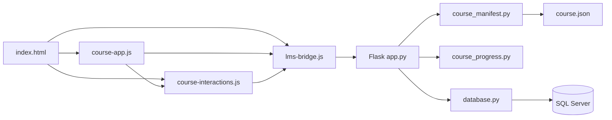

# Техническое описание курса «Безопасность»

**Версия:** 1.0  
**Дата:** июнь 2026  
**Тип курса:** native (нативный электронный курс)  
**Папка:** `backend/courses/bezopasnost/`  
**ID в БД:** `course_id = 2`

---

## 1. Общая архитектура

### 1.1. Место курса в системе

```
┌─────────────────┐     JWT + REST API     ┌──────────────────┐
│  Frontend LMS   │ ◄────────────────────► │  Flask Backend   │
│  (port 8000)    │                        │  (port 5000)     │
└────────┬────────┘                        └────────┬─────────┘
         │ launch URL                               │
         ▼                                          ▼
┌─────────────────────────────────────────────────────────────┐
│  /course-content/2/index.html?assignment_id=&authToken=     │
│  ┌─────────────┐  ┌──────────────────┐  ┌──────────────┐  │
│  │ course-app  │  │ course-interact. │  │  lms-bridge  │  │
│  └─────────────┘  └──────────────────┘  └──────────────┘  │
└─────────────────────────────────────────────────────────────┘
                              │
                              ▼
                    ┌──────────────────┐
                    │  SQL Server DB   │
                    │ Section_progress │
                    │ User_result      │
                    └──────────────────┘
```

Курс **не использует SCORM**. Вместо SCORM API применяется собственный JavaScript-мост `lms-bridge.js`, который обращается к REST API Flask.

### 1.2. Почему выбран native-подход, а не SCORM

| Критерий | Native | SCORM 2004 |
|----------|--------|------------|
| Кастомные интерактивы (flip-cards, drag-drop) | Полный контроль над HTML/CSS/JS | Ограничен рамками пакета |
| Gating навигации | Реализуется в `course-interactions.js` | Сложнее, зависит от authoring tool |
| Адаптивная вёрстка | Свободная вёрстка | Часто фиксированный размер слайда |
| Прогресс | REST API + `Section_progress` | CMI через `scorm_runtime.py` |

**Вывод:** для курса с богатыми интерактивами и строгим gating выбран native-тип с JSON-манифестом.

---

## 2. Карта файлов

### 2.1. Основные файлы курса

| Файл | Назначение |
|------|------------|
| `index.html` | Монолитный SPA: все 10 экранов, подключение CSS и JS |
| `course.json` | Манифест: разделы, типы, точка входа |
| `course-app.js` | Навигация, header, прогресс, содержание, действия кнопок |
| `course-interactions.js` | Интерактивы: слайдеры, flip-cards, drag-drop, квизы, аккордеоны |
| `lms-bridge.js` | Связь с LMS: auth, manifest, progress, complete, finish |
| `section-*-body.html` | Фрагменты для удобства редактирования (**не подключаются в runtime**) |
| `conclusion-body.html` | То же для заключения |

### 2.2. Стили

| Файл | Назначение |
|------|------------|
| `assets/globals.css` | Reset, базовая типографика |
| `assets/course-player.css` | Оболочка плеера: header, progress, экраны, overlay содержания |
| `assets/intro.css` | Экран введения |
| `assets/section-1.css` … `section-6.css` | Стили каждого раздела (префикс `s1-` … `s6-`) |
| `assets/conclusion.css` | Экран заключения |
| `assets/course-spacing.css` | **Единая система отступов** (загружается последней) |

### 2.3. Backend-зависимости

| Файл | Связь с курсом |
|------|----------------|
| `course_manifest.py` | Читает `course.json`, вычисляет scorable sections и `section_weight` |
| `course_progress.py` | Чистая математика баллов (порог 70%, практика = 50%) |
| `database.py` | `complete_section`, `finish_course`, `get_course_progress` |
| `app.py` | REST endpoints для native-курса |
| `course_storage.py` | Путь к папке `bezopasnost`, синхронизация metadata |

---

## 3. Манифест `course.json`

```json
{
  "title": "Правила использования ИТ-ресурсов",
  "course_type": "native",
  "entry": "index.html",
  "sections": [ ... ]
}
```

### 3.1. Структура разделов

| ID | Название | type | scorable | module |
|----|----------|------|----------|--------|
| splash | Обложка | splash | false | — |
| navigation | Инструкция по навигации | content | false | 1 |
| intro | Введение | intro | false | 2 |
| section-1 | Основы безопасности | content | **да** | 3 |
| section-2 | Работа с ИТ-ресурсами | content | **да** | 4 |
| section-3 | Работа в офисе и удаленно | content | **да** | 5 |
| section-4 | Работа в интернете | content | **да** | 6 |
| section-5 | Работа с клиентами | content | **да** | 7 |
| section-6 | Ответственность сотрудников | content | **да** | 8 |
| conclusion | Заключение | conclusion | false | 9 |

### 3.2. Логика scorable на backend

Функция `is_scorable_section()` в `course_manifest.py` исключает:
- типы: `splash`, `intro`, `conclusion`;
- ID: `navigation`, `intro`, `conclusion`;
- явный флаг `scorable: false`.

**Вес раздела:** `section_weight = 100 / scorable_count = 100/6 ≈ 16.67 баллов`.

---

## 4. Структура `index.html`

### 4.1. DOM-иерархия

```html
<div id="course-app">
  <header id="course-header">...</header>
  <main id="course-main">
    <section class="course-screen" id="screen-splash">...</section>
    <section class="course-screen" id="screen-navigation">...</section>
    ...
    <section class="course-screen" id="screen-conclusion">...</section>
  </main>
  <div id="contents-overlay">...</div>
</div>
```

Активный экран: класс `.active` на `.course-screen`.

### 4.2. Паттерн контентного раздела

Каждый раздел 1–6 состоит из трёх частей:

1. **Hero** (`*-part--hero`) — заголовок, вводный слайд
2. **Content** (`*-part--content`) — учебный материал + интерактивы
3. **Outro** (`*-part--outro`) — блок «Запомните» (изначально `.is-locked`)

### 4.3. Порядок загрузки скриптов

```html
<script src="lms-bridge.js"></script>
<script src="course-interactions.js"></script>
<script src="course-app.js"></script>
```

**Почему такой порядок:**
1. `lms-bridge` — данные LMS должны быть готовы до инициализации приложения;
2. `course-interactions` — обработчики интерактивов;
3. `course-app` — вызывает `LMSBridge.init()` и `CourseInteractions` при старте.

---

## 5. Модуль `course-app.js`

### 5.1. Ключевые структуры данных

```javascript
const FLOW = ['splash', 'navigation', 'intro', 'section-1', ..., 'conclusion'];
const MODULE_META = { /* заголовки и теги для карточек содержания */ };
```

`FLOW` — линейный порядок экранов. Навигация «Далее/Назад» перемещает по этому массиву.

### 5.2. Основные функции

| Функция | Назначение |
|---------|------------|
| `switchScreen(screenId)` | Показать экран, скрыть остальные; вызвать `CourseInteractions.scanScreen()` |
| `updateNavButtons()` | Включить/отключить кнопки навигации по `isGateReady()` |
| `completeCurrentScreen()` | Отправить завершение раздела через `LMSBridge.completeScreen()` |
| `renderContentsGrid()` | Построить overlay «Содержание» с lock/done/current |
| `handleAction(event)` | Обработка `data-action`: start, back, next, contents, finish |
| `bindGlobalNavigation()` | Делегирование кликов на `[data-action]` |

### 5.3. Resume (возобновление)

При повторном входе:
1. `LMSBridge.init()` загружает прогресс;
2. `LMSBridge.getResumeScreen()` находит первый незавершённый раздел;
3. `course-app` переключается на этот экран.

### 5.4. Почему монолитный HTML

**Плюсы:**
- Нет задержек на подгрузку фрагментов;
- Проще offline-совместимость;
- Один HTTP-запрос для всей структуры.

**Минусы:**
- Большой файл (~2300 строк);
- Файлы `section-*-body.html` нужно синхронизировать вручную.

---

## 6. Модуль `course-interactions.js`

### 6.1. Архитектурный принцип: declarative gating

Поведение задаётся **data-атрибутами** в HTML, а не жёстко в JS:

| Атрибут | Что разблокирует |
|---------|------------------|
| `data-flip-set="id"` + `data-flip` | Все карточки перевернуты |
| `data-slider="id"` + `data-slide` | Все слайды просмотрены |
| `data-quiz-id="id"` + `data-quiz` | Квиз решён верно |
| `data-drag-task="id"` + `data-drag-drop` | Drag-drop выполнен верно |
| `data-gated-by-flip="setId"` | Целевой блок, ждущий flip |
| `data-gated-by-slider="sliderId"` | Целевой блок, ждущий slider |
| `data-gated-by="taskId"` | Целевой блок, ждущий quiz/drag |

**Почему declarative:** один JS-модуль обслуживает все разделы; добавление нового интерактива — правка HTML, а не дублирование логики.

### 6.2. Трёхуровневая система gating

```
Уровень 1: Контентные блоки (.is-locked + data-gated-by*)
     ↓ все разблокированы
Уровень 2: Outro-блок «Запомните» (article[class*="-part--outro"])
     ↓ видим
Уровень 3: Кнопка «Далее» (CourseInteractions.isGateReady)
     ↓ активна
Переход на следующий экран → LMSBridge.completeScreen
```

### 6.3. Типы интерактивов по разделам

| Раздел | Интерактивы |
|--------|-------------|
| section-1 | Flip-cards (ИТ-типы), 2 слайдера, drag-drop (сортировка паролей) |
| section-2 | 4 маркера-модалки, 3 квиза (single/multiple) |
| section-3 | 6 маркеров, аккордеон (~10 пунктов), квиз |
| section-4 | Квиз deepfake |
| section-5 | 2 квиза с цепочкой gating, flip-cards (этика) |
| section-6 | Flip-cards (инциденты) |
| intro | 3 scroll-части (`data-intro-part`) без квизов |

### 6.4. Квизы

**Типы:**
- `data-quiz-type="single"` — один вариант;
- `data-quiz-type="multiple"` — несколько, точное совпадение множества.

**Правильные ответы:** `data-correct="2"` или `data-correct="2,3,5"`.

**Состояния кнопок:**
- После «Ответить» — «Ответить» и «Сбросить» неактивны;
- «Попробовать снова» — сброс и повторная активация.

**Особый случай `quiz-converter`:** при выборе вариантов 1 или 4 показывается `data-quiz-feedback-severe` (усиленное предупреждение).

### 6.5. Drag-and-drop

- Элементы: `[data-item-id]` с `data-correct` = ID зоны `[data-drop]`;
- Поддержка touch: `elementFromPoint` на `touchend`;
- Состояние `.is-solved` после успешного подтверждения.

### 6.6. localStorage

Ключ: `bezopasnost:{assignment_id}:{screenId}:{taskId}`

**Зачем:** при обновлении страницы квиз/drag не нужно решать заново.  
**Важно:** серверный прогресс (LMS) и клиентский (localStorage) — **разные уровни**. Сервер знает только о завершении раздела целиком.

### 6.7. Bypass при resume

```javascript
function isScreenFullyReady() {
  if (LMSBridge.isSectionCompleted(currentSection.id)) return true;
  // иначе проверка всех интерактивов
}
```

Если раздел уже завершён в LMS — интерактивы можно не повторять.

---

## 7. Модуль `lms-bridge.js`

### 7.1. Инициализация

```javascript
LMSBridge.init() → {
  parse URL params: course_id, assignment_id, authToken
  GET /api/courses/{id}?assignment_id=...
  → manifest + progress
}
```

### 7.2. API-вызовы

| Метод | Endpoint | Когда |
|-------|----------|-------|
| GET | `/api/courses/{id}?assignment_id=` | При старте |
| POST | `/api/courses/{id}/sections/{section_id}/complete` | При переходе «Далее» с готового экрана |
| POST | `/api/courses/{id}/finish` | На экране заключения |

**Тело `complete`:**
```json
{
  "assignment_id": 123,
  "is_practical": true/false,
  "passed_first_try": true/false,
  "section_weight": 16.67
}
```

### 7.3. Последовательная разблокировка

`isSectionUnlocked(sectionId)` — все предыдущие разделы (кроме splash) должны быть в `completedSections`.

### 7.4. Почему API base динамический

```javascript
const API_BASE = (location.port === '5000')
  ? '/api'
  : 'http://127.0.0.1:5000/api';
```

Курс открывается с backend (:5000), а LMS — с frontend (:8000). При кросс-порте нужен абсолютный URL.

---

## 8. Система стилей

### 8.1. `course-spacing.css` — design tokens

```css
#course-app {
  --ds-gap-same: 40px;
  --ds-h2-before: 20px;
  --ds-h2-after: 60px;
  --ds-quiz-option-gap: 15px;
  --ds-content-to-player: 150px;
}
```

**Почему загружается последней:** перебивает локальные отступы в `section-N.css` без правки каждого файла.

### 8.2. Ключевые CSS-классы состояния

| Класс | Кто ставит | Значение |
|-------|------------|----------|
| `.active` | course-app | Текущий экран/слайд |
| `.is-locked` | course-interactions | Скрытый gated-контент |
| `.is-flipped` | course-interactions | Перевёрнутая карточка |
| `.is-solved` | course-interactions | Решённый квиз/drag |
| `.is-disabled` | course-app | Заблокированная кнопка навигации |
| `.is-hidden` | CSS/JS | Скрытый feedback-блок |

### 8.3. BEM-подобное именование

Префикс раздела: `s1-`, `s2-`, … `s6-`.  
Общие классы плеера: `course-screen`, `slide-btn`, `btn-next`.

---

## 9. Интеграция с LMS: поток данных

```
1. Студент нажимает «НАЧАТЬ КУРС»
2. instruction.js → GET /api/courses/2?assignment_id=X
3. Backend возвращает launch_url, manifest, progress
4. Редирект на /course-content/2/index.html?...
5. lms-bridge.js загружает данные
6. Студент проходит section-1:
   a. Решает интерактивы (клиент)
   b. Нажимает «Далее»
   c. POST .../sections/section-1/complete
   d. database.complete_section() → Section_progress
   e. _recalculate_assignment_score() → User_result
7. После всех 6 разделов → POST .../finish
8. assignment_status_from_score() → passed/failed
```

### 9.1. Расчёт баллов (`course_progress.py`)

| Ситуация | Балл |
|----------|------|
| Обычный раздел, с 1-й попытки | `section_weight` (≈16.67) |
| Практическое задание, не с 1-й | `section_weight / 2` |
| Повторное завершение раздела | `merge_section_score` — лучший результат |
| Итого | `cap_course_score` — макс. 100 |
| Прохождение | ≥ 70% → `passed` |

### 9.2. Таблицы БД

| Таблица | Роль |
|---------|------|
| `Courses` | Справочник курсов (title, storage) |
| `Assignments` | Назначение: user + course + даты + status |
| `Section_progress` | Прогресс по разделам: score, first_attempt_failed |
| `User_result` | Итоговый балл по курсу |

---

## 10. Зависимости между модулями



**Нет сборщика (webpack/vite):** три IIFE-модуля в глобальной области.  
**Нет фреймворка (React/Vue):** ванильный JS для минимальных зависимостей и простоты развёртывания.

---

## 11. Потенциальные вопросы на защите и ответы

### Вопрос 1. Почему курс реализован как SPA в одном HTML-файле?

**Ответ:** Это упрощает развёртывание (один entry point для backend), исключает задержки при переключении экранов и позволяет полностью контролировать интерактивы. Файлы `section-*-body.html` служат для удобства разработки, но runtime-загрузка фрагментов не используется, чтобы не усложнять инфраструктуру.

### Вопрос 2. Как работает блокировка кнопки «Далее»?

**Ответ:** `course-interactions.js` отслеживает выполнение всех требований экрана через `isGateReady(screenId)`. `course-app.js` в `updateNavButtons()` добавляет класс `.is-disabled`, если gate не готов. Три уровня: контентные блоки → outro → навигация.

### Вопрос 3. Чем отличается клиентский прогресс от серверного?

**Ответ:** localStorage хранит состояние отдельных квизов/drag для UX при обновлении страницы. Сервер (`Section_progress`) фиксирует только факт завершения целого раздела с итоговым баллом. Это разделение позволяет не отправлять запрос на каждый клик в квизе.

### Вопрос 4. Почему практические задания дают половину баллов?

**Ответ:** Бизнес-правило в `calculate_section_score()`: если `is_practical=true` и `passed_first_try=false`, начисляется `section_weight / 2`. Это стимулирует внимательность при первой попытке, но не блокирует прохождение.

### Вопрос 5. Как определяется, какие разделы оцениваются?

**Ответ:** Функция `is_scorable_section()` в `course_manifest.py` фильтрует по типу (`splash`, `intro`, `conclusion`), по ID (`navigation`) и по явному `scorable: false`. Для bezopasnost остаются section-1…section-6.

### Вопрос 6. Зачем `course-spacing.css` подключается последним?

**Ответ:** Он содержит CSS-переменные (`--ds-*`) и правила с высокой специфичностью (`#course-app`), которые унифицируют отступы поверх индивидуальных стилей разделов без редактирования каждого `section-N.css`.

### Вопрос 7. Как курс узнаёт assignment_id и токен?

**Ответ:** Из query-параметров URL при запуске: `?assignment_id=...&authToken=...&returnUrl=...`. `lms-bridge.js` парсит `window.location.search` при `init()`.

### Вопрос 8. Что произойдёт при истечении JWT?

**Ответ:** API вернёт 401. `lms-bridge.js` обрабатывает ошибку и перенаправляет на страницу входа LMS с сообщением.

### Вопрос 9. Почему не SCORM для этого курса?

**Ответ:** SCORM хорошо подходит для готовых пакетов из authoring tools, но ограничивает кастомные интерактивы (drag-drop, flip-cards, цепочки gating). Native-подход даёт полный контроль и прямую интеграцию с REST API.

### Вопрос 10. Как реализован drag-drop на мобильных?

**Ответ:** Помимо стандартных HTML5 drag events, добавлена обработка touch: при `touchstart` элемент фиксируется, при `touchend` через `document.elementFromPoint()` определяется зона сброса.

### Вопрос 11. Что такое `data-quiz-feedback-severe`?

**Ответ:** Специальный блок обратной связи для квиза `quiz-converter` в section-2. Показывается, если пользователь выбрал «опасные» варианты (1 или 4), — усиленное предупреждение вместо стандартной ошибки.

### Вопрос 12. Как работает содержание курса (overlay)?

**Ответ:** `renderContentsGrid()` строит карточки модулей из `MODULE_META`. Состояния: locked (ещё не разблокирован), current (текущий), done (завершён). Клик по доступной карточке вызывает `switchScreen()`.

### Вопрос 13. Сколько баллов нужно для прохождения?

**Ответ:** `PASS_THRESHOLD = 70` в `course_progress.py`. При 6 разделах по ~16.67 баллов максимум = 100. Минимум для passed: 70 баллов (например, 5 разделов на полный балл + 1 на половину).

### Вопрос 14. Какие юнит-тесты покрывают логику?

**Ответ:** `backend/test_course_progress.py` — тесты `cap_course_score`, `merge_section_score`, `calculate_section_score`, `get_scorable_sections`, манифест bezopasnost. Запуск: `py -3 test_course_progress.py`.

### Вопрос 15. Как добавить новый интерактив в курс?

**Ответ:**
1. Разметить HTML с нужными `data-*` атрибутами;
2. Если тип уже поддерживается (`data-quiz`, `data-flip`, `data-slider`, `data-drag-drop`) — дополнительный JS не нужен;
3. Если новый тип — добавить `init*()` в `course-interactions.js` и вызов в `scanScreen()`;
4. При необходимости — стили в соответствующий `section-N.css`.

---

## 12. Рекомендации по сопровождению

1. **Синхронизация фрагментов:** при правке `section-N-body.html` обновлять соответствующий блок в `index.html`.
2. **Отступы:** менять только `course-spacing.css`, не трогать section CSS без необходимости.
3. **Новый scorable-раздел:** добавить в `course.json`, создать экран в `index.html`, обновить `FLOW` и `MODULE_META` в `course-app.js`.
4. **Сброс прогресса:** `py -3 reset_bezopasnost.py` (очищает БД, не трогает файлы).
5. **Тестирование:** прогонять `test_course_progress.py` после изменений в логике баллов.

---

## 13. Глоссарий

| Термин | Определение |
|--------|-------------|
| **Gating** | Блокировка навигации до выполнения условий |
| **Native course** | Курс без SCORM, на собственном JS + REST API |
| **Manifest** | `course.json` — описание структуры курса |
| **section_weight** | Балл за один scorable-раздел |
| **IIFE** | Immediately Invoked Function Expression — паттерн инкапсуляции JS |
| **SPA** | Single Page Application — одностраничное приложение |
