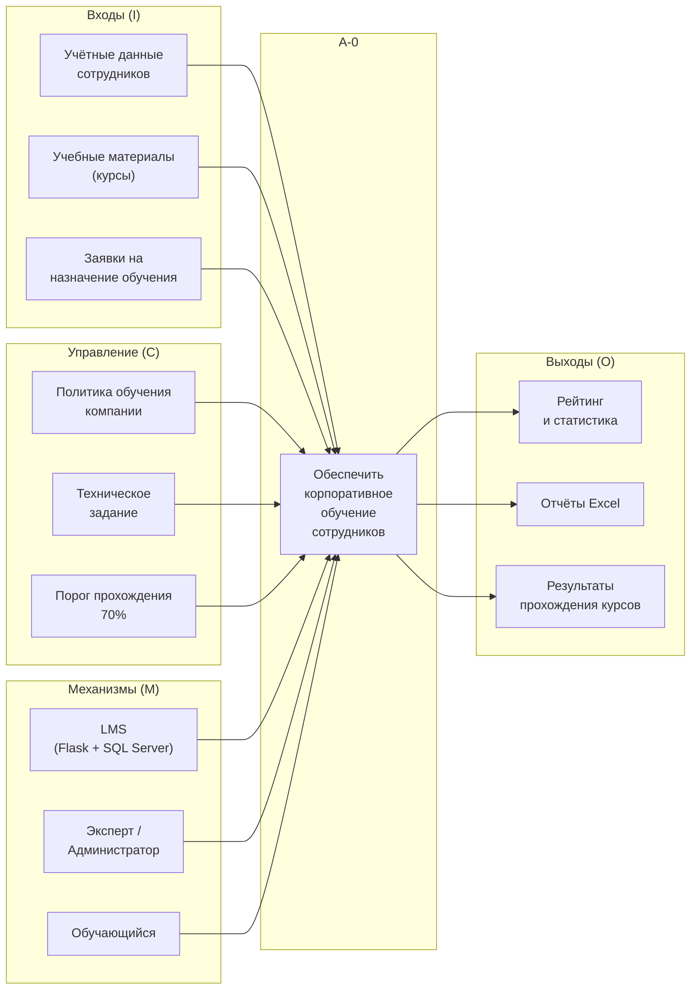
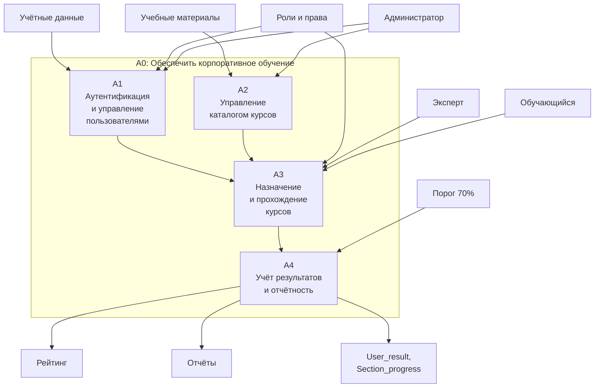

# Приложение Г. Диаграмма IDEF0

**Проект:** Адаптационный курс для сотрудников ритуальной компании  
**Версия:** 1.0  
**Дата:** июнь 2026

---

## Рисунок 1. Контекстная диаграмма IDEF0 (A-0)

**Функция A-0:** «Обеспечить корпоративное обучение сотрудников»

### Расшифровка контекстной диаграммы

| Элемент | Описание |
|---------|----------|
| **Входы** | Данные пользователей, файлы курсов, запросы на назначение |
| **Управление** | Корпоративные правила обучения, ТЗ, требования к оценке |
| **Механизмы** | Программная платформа LMS, роли пользователей |
| **Выходы** | Рейтинг, отчёты, зафиксированные результаты в БД |

---

## Рисунок 2. Декомпозиция контекстной диаграммы IDEF0 (A0)

**Декомпозиция функции A0 на подфункции A1–A4:**

### Описание подфункций

| ID | Название | Содержание |
|----|----------|------------|
| **A1** | Аутентификация и управление пользователями | Вход в систему (JWT), CRUD пользователей, роли, должности |
| **A2** | Управление каталогом курсов | Загрузка SCORM, редактирование метаданных, скачивание архивов |
| **A3** | Назначение и прохождение курсов | Создание Assignments, запуск плеера, сохранение Section_progress |
| **A4** | Учёт результатов и отчётность | Расчёт баллов, рейтинг, Excel-отчёт, статусы passed/failed |

### Связи между подфункциями

1. **A1 → A3:** только авторизованный пользователь с активным назначением может проходить курс.
2. **A2 → A3:** курс из каталога выбирается при назначении и запуске.
3. **A3 → A4:** завершение разделов и курса записывается в БД для аналитики.

---

## Примечание для переноса в Word

Диаграммы подготовлены в нотации Mermaid. Для вставки в «проектная документация.docx»:

1. Откройте файл `.md` в VS Code / Cursor с предпросмотром Mermaid.
2. Экспортируйте рисунки как PNG (или перерисуйте в draw.io / Visio по схеме выше).
3. Вставьте подписи: «Рисунок 1. Контекстная диаграмма IDEF0», «Рисунок 2. Декомпозиция контекстной диаграммы IDEF0».
