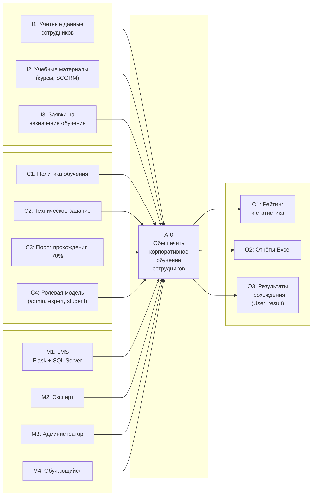
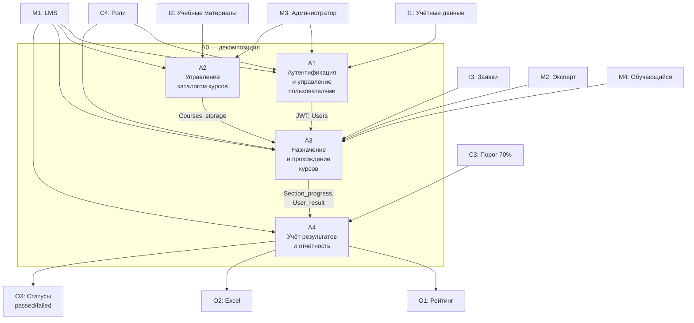
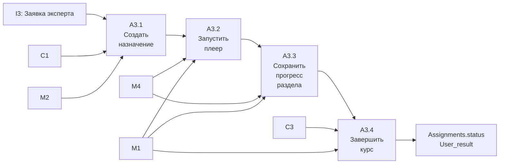

# Приложение Г. Диаграммы IDEF0

**Проект:** Адаптационный курс для сотрудников ритуальной компании  
**Нотация:** IDEF0 (ICOM: Input, Control, Output, Mechanism)  
**Версия:** 1.1  
**Дата:** июнь 2026

---

## Рисунок 1. Контекстная диаграмма IDEF0 (A-0)

**Функция A-0:** «Обеспечить корпоративное обучение сотрудников»

Нотация соответствует стандарту IDEF0: **вход** — слева, **управление** — сверху, **выход** — справа, **механизм** — снизу.

```mermaid
flowchart LR
    subgraph IN[" "]
        direction TB
        I1["I1: Учётные данные\nсотрудников"]
        I2["I2: Учебные материалы\n(курсы, SCORM)"]
        I3["I3: Заявки на\nназначение обучения"]
    end

    subgraph BOX[" "]
        A0["A-0\nОбеспечить\nкорпоративное\nобучение\nсотрудников"]
    end

    subgraph OUT[" "]
        direction TB
        O1["O1: Рейтинг\nи статистика"]
        O2["O2: Отчёты Excel"]
        O3["O3: Результаты\nпрохождения\n(User_result)"]
    end

    subgraph CTL[" "]
        direction TB
        C1["C1: Политика обучения"]
        C2["C2: Техническое задание"]
        C3["C3: Порог прохождения 70%"]
        C4["C4: Ролевая модель\n(admin, expert, student)"]
    end

    subgraph MEC[" "]
        direction TB
        M1["M1: LMS\nFlask + SQL Server"]
        M2["M2: Эксперт"]
        M3["M3: Администратор"]
        M4["M4: Обучающийся"]
    end

    I1 --> A0
    I2 --> A0
    I3 --> A0
    C1 --> A0
    C2 --> A0
    C3 --> A0
    C4 --> A0
    M1 --> A0
    M2 --> A0
    M3 --> A0
    M4 --> A0
    A0 --> O1
    A0 --> O2
    A0 --> O3
```

### Расшифровка ICOM

| Тип | Код | Элемент | Описание |
|-----|-----|---------|----------|
| **Вход** | I1 | Учётные данные | Таблицы Users, Position, Roles |
| **Вход** | I2 | Учебные материалы | Файлы в `backend/courses/` |
| **Вход** | I3 | Заявки на назначение | Действия эксперта в assignments.html |
| **Управление** | C1 | Политика обучения | Сроки date_from–date_to, обязательность курса |
| **Управление** | C2 | ТЗ | Приложение Б |
| **Управление** | C3 | Порог 70% | `PASS_THRESHOLD` в course_progress.py |
| **Управление** | C4 | Роли | PAGE_ACCESS, JWT role |
| **Механизм** | M1 | LMS | Программная платформа |
| **Механизм** | M2–M4 | Пользователи | Эксперт, админ, обучающийся |
| **Выход** | O1 | Рейтинг | GET /api/rating |
| **Выход** | O2 | Отчёты | course_report.xlsx |
| **Выход** | O3 | Результаты | Assignments, Section_progress, User_result |

---

## Рисунок 2. Декомпозиция A0 (диаграмма A0)

```mermaid
flowchart TB
    I1["I1: Учётные данные"] --> A1
    I2["I2: Учебные материалы"] --> A2
    I3["I3: Заявки"] --> A3

    subgraph A0_DECOMP["A0 — декомпозиция"]
        A1["A1\nАутентификация\nи управление\nпользователями"]
        A2["A2\nУправление\nкаталогом курсов"]
        A3["A3\nНазначение\nи прохождение\nкурсов"]
        A4["A4\nУчёт результатов\nи отчётность"]
    end

    A1 -->|"JWT, Users"| A3
    A2 -->|"Courses, storage"| A3
    A3 -->|"Section_progress,\nUser_result"| A4

    A4 --> O1["O1: Рейтинг"]
    A4 --> O2["O2: Excel"]
    A4 --> O3["O3: Статусы\npassed/failed"]

    C4["C4: Роли"] --> A1
    C4 --> A3
    C3["C3: Порог 70%"] --> A4

    M3["M3: Администратор"] --> A1
    M3 --> A2
    M2["M2: Эксперт"] --> A3
    M4["M4: Обучающийся"] --> A3
    M1["M1: LMS"] --> A1
    M1 --> A2
    M1 --> A3
    M1 --> A4
```

### Описание подфункций A1–A4

| ID | Название | Вход | Выход | Управление | Механизм | Реализация |
|----|----------|------|-------|------------|----------|------------|
| **A1** | Аутентификация и пользователи | I1 | JWT, Users | C4 | M1, M3 | login.html, users.html, POST /api/login |
| **A2** | Каталог курсов | I2 | Courses | C2 | M1, M3 | admin-courses.html, scorm_importer |
| **A3** | Назначение и прохождение | I3, данные A1, A2 | Section_progress | C1, C4 | M2, M4 | assignments.html, course-app.js |
| **A4** | Учёт и отчётность | данные A3 | O1, O2, O3 | C3 | M1, M2 | rating.html, get_report_data() |

### Потоки между подфункциями

1. **A1 → A3:** только авторизованный пользователь с ролью student/expert и активным назначением открывает курс.
2. **A2 → A3:** при назначении и запуске используется `Courses.storage` и manifest.
3. **A3 → A4:** каждое `completeSection` и `finishCourse` обновляет БД для аналитики.

---

## Рисунок 3. Декомпозиция A3 (назначение и прохождение)

```mermaid
flowchart LR
    I3["I3: Заявка эксперта"] --> A31
    A31["A3.1\nСоздать\nназначение"] --> A32
    A32["A3.2\nЗапустить\nплеер"] --> A33
    A33["A3.3\nСохранить\nпрогресс\nраздела"] --> A34
    A34["A3.4\nЗавершить\nкурс"] --> O3a["Assignments.status\nUser_result"]

    C1 --> A31
    C3 --> A34
    M2 --> A31
    M4 --> A32
    M4 --> A33
    M1 --> A32
    M1 --> A33
    M1 --> A34
```

| ID | Функция | API | Альтернатива |
|----|---------|-----|--------------|
| A3.1 | Создать назначение | POST /api/assignments | Ошибка: дубликат active |
| A3.2 | Запустить плеер | GET /api/courses/{id} | Ошибка: нет назначения |
| A3.3 | Сохранить раздел | POST .../complete | Повтор: merge_section_score |
| A3.4 | Завершить курс | POST .../finish | passed / failed по порогу |

---

## Примечание для переноса в Word

При ручной отрисовке в Visio используйте **прямоугольник функции** с меткой A0, стрелки I/C/O/M по сторонам, как на учебном шаблоне IDEF0. Подписи: «Рисунок 1. Контекстная диаграмма IDEF0», «Рисунок 2. Декомпозиция A0», «Рисунок 3. Декомпозиция A3».
