# Приложение Д. Диаграмма Use Case

**Проект:** Адаптационный курс для сотрудников ритуальной компании  
**Версия:** 1.0  
**Дата:** июнь 2026

---

## Рисунок 3. Use-Case диаграмма

```mermaid
flowchart TB
    subgraph actors["Акторы"]
        Student(("Обучающийся"))
        Expert(("Эксперт"))
        Admin(("Администратор"))
    end

    subgraph system["LMS — Адаптационный курс"]
        UC01["Войти в систему"]
        UC02["Выйти из системы"]
        UC03["Просмотреть рейтинг"]
        UC04["Открыть личный кабинет"]
        UC05["Загрузить фото профиля"]
        UC06["Просмотреть назначенные курсы"]
        UC07["Пройти курс"]
        UC08["Закрыть курс\n(сохранить прогресс)"]
        UC09["Назначить курс\nсотруднику"]
        UC10["Просмотреть статистику\nпрохождения"]
        UC11["Сформировать отчёт Excel"]
        UC12["Управлять\nпользователями"]
        UC13["Управлять курсами"]
        UC14["Загрузить SCORM-пакет"]
        UC15["Скачать курс\n(ZIP/RAR)"]
    end

    Student --> UC01
    Student --> UC02
    Student --> UC03
    Student --> UC04
    Student --> UC05
    Student --> UC06
    Student --> UC07
    Student --> UC08

    Expert --> UC01
    Expert --> UC02
    Expert --> UC03
    Expert --> UC04
    Expert --> UC05
    Expert --> UC06
    Expert --> UC07
    Expert --> UC08
    Expert --> UC09
    Expert --> UC10
    Expert --> UC11

    Admin --> UC01
    Admin --> UC02
    Admin --> UC03
    Admin --> UC04
    Admin --> UC12
    Admin --> UC13
    Admin --> UC14
    Admin --> UC15
    Admin --> UC11
```

---

## Таблица прецедентов

| ID | Прецедент | Актор | Краткое описание |
|----|-----------|-------|------------------|
| UC-01 | Войти в систему | Все | Авторизация по логину/паролю, получение JWT |
| UC-02 | Выйти из системы | Все | Очистка сессии, переход на login.html |
| UC-03 | Просмотреть рейтинг | Все | Таблица лидеров на rating.html |
| UC-04 | Открыть личный кабинет | Все | Просмотр профиля на profile.html |
| UC-05 | Загрузить фото профиля | Обучающийся, эксперт | POST /api/profile/photo |
| UC-06 | Просмотреть назначенные курсы | Обучающийся, эксперт | Карточки на instruction.html |
| UC-07 | Пройти курс | Обучающийся, эксперт | Запуск плеера, интерактивы, завершение |
| UC-08 | Закрыть курс | Обучающийся, эксперт | Выход в LMS с сохранением прогресса |
| UC-09 | Назначить курс сотруднику | Эксперт | Модальное окно на assignments.html |
| UC-10 | Просмотреть статистику прохождения | Эксперт | Рейтинг с фильтром по курсу |
| UC-11 | Сформировать отчёт Excel | Эксперт, админ | GET /api/report → course_report.xlsx |
| UC-12 | Управлять пользователями | Админ | CRUD на users.html |
| UC-13 | Управлять курсами | Админ | Редактирование, удаление на admin-courses.html |
| UC-14 | Загрузить SCORM-пакет | Админ | POST /api/admin/courses |
| UC-15 | Скачать курс | Админ | GET /api/admin/courses/{id}/download |

---

## Связи «включить» и «расширить»

| Базовый прецедент | Связь | Дочерний прецедент |
|-------------------|-------|-------------------|
| UC-07 Пройти курс | include | UC-01 Войти в систему |
| UC-09 Назначить курс | include | UC-01 Войти в систему |
| UC-11 Сформировать отчёт | extend | UC-03 Просмотреть рейтинг |
| UC-08 Закрыть курс | extend | UC-07 Пройти курс |

---

## Примечание для переноса в Word

Для курсовой работы диаграмму можно экспортировать из Mermaid в PNG и вставить как «Рисунок 3. Use-Case диаграмма».
