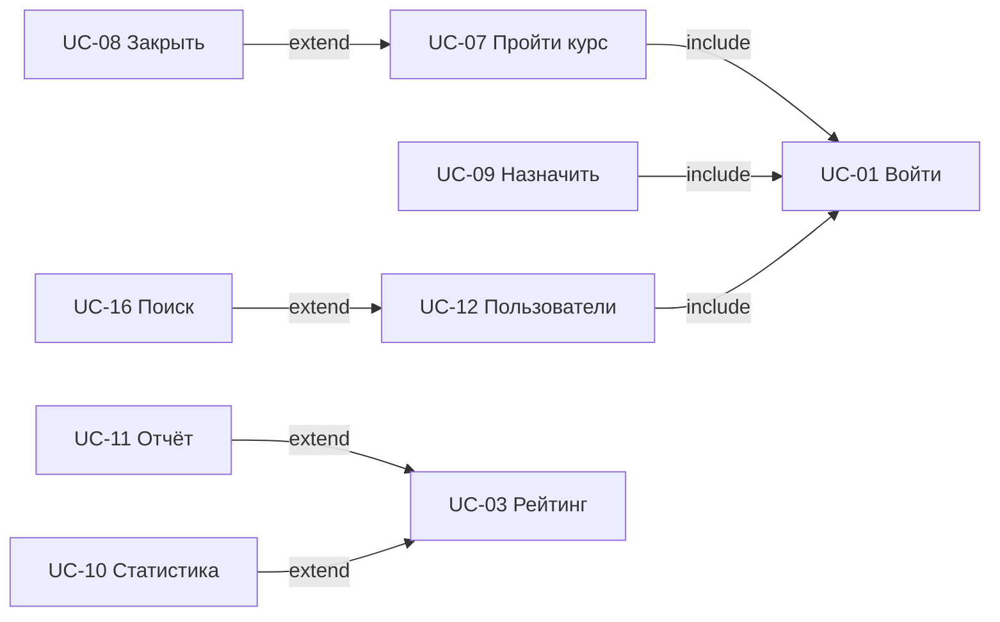

# Приложение Д. Диаграмма прецедентов (Use Case, UML)

**Проект:** Адаптационный курс для сотрудников ритуальной компании  
**Нотация:** UML Use Case Diagram  
**Версия:** 1.1  
**Дата:** июнь 2026

---

## Рисунок 3. Диаграмма прецедентов

```mermaid
flowchart TB
    subgraph actors["Акторы"]
        Student((Обучающийся))
        Expert((Эксперт))
        Admin((Администратор))
    end

    subgraph lms["Система LMS"]
        direction TB
        UC01([UC-01 Войти в систему])
        UC02([UC-02 Выйти из системы])
        UC03([UC-03 Просмотреть рейтинг])
        UC04([UC-04 Личный кабинет])
        UC05([UC-05 Загрузить фото])
        UC06([UC-06 Назначенные курсы])
        UC07([UC-07 Пройти курс])
        UC08([UC-08 Закрыть курс])
        UC09([UC-09 Назначить курс])
        UC10([UC-10 Статистика курса])
        UC11([UC-11 Отчёт Excel])
        UC12([UC-12 Управление пользователями])
        UC13([UC-13 Управление курсами])
        UC14([UC-14 Загрузить SCORM])
        UC15([UC-15 Скачать курс])
        UC16([UC-16 Поиск пользователей])
        UC17([UC-17 Поиск курсов])
    end

    Student --- UC01
    Student --- UC02
    Student --- UC03
    Student --- UC04
    Student --- UC05
    Student --- UC06
    Student --- UC07
    Student --- UC08

    Expert --- UC01
    Expert --- UC02
    Expert --- UC03
    Expert --- UC04
    Expert --- UC05
    Expert --- UC06
    Expert --- UC07
    Expert --- UC08
    Expert --- UC09
    Expert --- UC10
    Expert --- UC11

    Admin --- UC01
    Admin --- UC02
    Admin --- UC03
    Admin --- UC04
    Admin --- UC11
    Admin --- UC12
    Admin --- UC13
    Admin --- UC14
    Admin --- UC15
    Admin --- UC16
    Admin --- UC17
```

---

## Таблица прецедентов (полная)

| ID | Прецедент | Актор | Страница / API | Основной сценарий | Альтернатива |
|----|-----------|-------|----------------|-------------------|--------------|
| UC-01 | Войти в систему | Все | login.html, POST /api/login | Ввод email/пароля → JWT → редирект | A1: неверный пароль; A2: пустые поля |
| UC-02 | Выйти | Все | common.js logout | Очистка sessionStorage → login.html | — |
| UC-03 | Просмотреть рейтинг | Все | rating.html, GET /api/rating | Таблица баллов по пользователям | A1: нет результатов — пустая таблица |
| UC-04 | Личный кабинет | Все | profile.html | Просмотр ФИО, должности, фото | A1: expert — только просмотр (PUT запрещён) |
| UC-05 | Загрузить фото | Student, Expert | POST /api/profile/photo | Выбор файла → сохранение | A1: неверный формат |
| UC-06 | Назначенные курсы | Student, Expert | instruction.html | Список из GET /api/my-courses | A1: нет назначений |
| UC-07 | Пройти курс | Student, Expert | course-app.js | Запуск → разделы → finish | A1: gate не пройден; A2: SCORM-путь |
| UC-08 | Закрыть курс | Student, Expert | lms-bridge exitCourse | Выход с сохранением прогресса | A1: отмена в диалоге |
| UC-09 | Назначить курс | Expert | assignments.html | POST /api/assignments | A1: дубликат active; A2: неверные даты |
| UC-10 | Статистика курса | Expert | rating.html?course_id | Рейтинг с фильтром | — |
| UC-11 | Отчёт Excel | Expert, Admin | GET /api/report | Фильтры → скачивание xlsx | A1: нет данных 404 |
| UC-12 | Управление пользователями | Admin | users.html | CRUD /api/admin/users | A1: дубликат email |
| UC-13 | Управление курсами | Admin | admin-courses.html | Редактирование, удаление | A1: курс с назначениями |
| UC-14 | Загрузить SCORM | Admin | POST /api/admin/courses | ZIP + imsmanifest | A1: невалидный архив |
| UC-15 | Скачать курс | Admin | GET .../download | ZIP/RAR архив | A1: нет файлов |
| UC-16 | Поиск пользователей | Admin | GET ?search= | LIKE по ФИО, email | A1: ничего не найдено |
| UC-17 | Поиск курсов | Admin | admin-courses.js | Клиентский фильтр списка | — |

---

## Связи include и extend (UML)

```mermaid
flowchart LR
    UC07[UC-07 Пройти курс] -->|include| UC01[UC-01 Войти]
    UC09[UC-09 Назначить] -->|include| UC01
    UC12[UC-12 Пользователи] -->|include| UC01
    UC11[UC-11 Отчёт] -->|extend| UC03[UC-03 Рейтинг]
    UC08[UC-08 Закрыть] -->|extend| UC07
    UC10[UC-10 Статистика] -->|extend| UC03
    UC16[UC-16 Поиск] -->|extend| UC12
```

| Связь | Тип | Обоснование |
|-------|-----|-------------|
| UC-07 → UC-01 | include | Прохождение невозможно без авторизации |
| UC-09 → UC-01 | include | Назначение только для эксперта с JWT |
| UC-11 → UC-03 | extend | Отчёт вызывается со страницы рейтинга |
| UC-08 → UC-07 | extend | Выход — опциональное продолжение прохождения |
| UC-10 → UC-03 | extend | Статистика — рейтинг с предзаполненным курсом |

---

## Матрица актор × прецедент

| Прецедент | Обучающийся | Эксперт | Администратор |
|-----------|:-----------:|:-------:|:-------------:|
| UC-01 … UC-08 | ✓ | ✓ | ✓ (кроме UC-06/07 для admin*) |
| UC-09, UC-10 | | ✓ | |
| UC-11 | | ✓ | ✓ |
| UC-12 … UC-17 | | | ✓ |

\* Администратор не проходит обучение через instruction.html в штатном сценарии ТЗ.

---

## Примечание для переноса в Word

Оформите как **«Рисунок 3. Диаграмма прецедентов»**. В UML-редакторе используйте овалы прецедентов и человечков-акторов.
