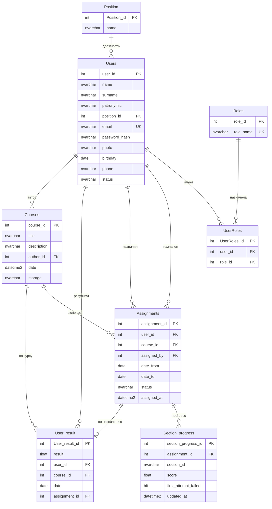

# Приложение Е. ER-диаграмма

**Проект:** Адаптационный курс для сотрудников ритуальной компании  
**Версия:** 1.0  
**Дата:** июнь 2026  
**СУБД:** Microsoft SQL Server, база `LearningPlatformDB`

---

## Рисунок 4. ER-диаграмма

---

## Описание связей

| Связь | Тип | Описание |
|-------|-----|----------|
| Users — UserRoles — Roles | M:N | Пользователь может иметь одну роль (через связующую таблицу) |
| Position — Users | 1:N | Справочник должностей |
| Users — Assignments (user_id) | 1:N | Назначения, полученные сотрудником |
| Users — Assignments (assigned_by) | 1:N | Назначения, созданные экспертом |
| Courses — Assignments | 1:N | Курс может быть назначен многим сотрудникам |
| Assignments — Section_progress | 1:N | Прогресс по разделам в рамках назначения |
| Users — User_result | 1:N | Итоговые баллы пользователя |
| Courses — User_result | 1:N | Результаты по курсу |
| Assignments — User_result | 1:1 | Результат привязан к конкретному назначению |
| Users — Courses (author_id) | 1:N | Автор (создатель) записи курса в каталоге |

---

## Примечание о структуре курса

Разделы, квизы и интерактивы **не хранятся в отдельных таблицах БД**. Структура нативного курса описана в файле `course.json` в папке `backend/courses/<storage>/`. SCORM-курсы используют `imsmanifest.xml`.

Концептуальные сущности «Модуль» и «Квиз» из учебного шаблона отображаются на:

- **Модуль** → `section_id` в `Section_progress` и записи manifest;
- **Квиз** → HTML-разметка с `data-quiz` в файлах курса.

---

## Примечание для переноса в Word

Экспортируйте диаграмму как «Рисунок 4. ER-диаграмма» для включения в пояснительную записку.
