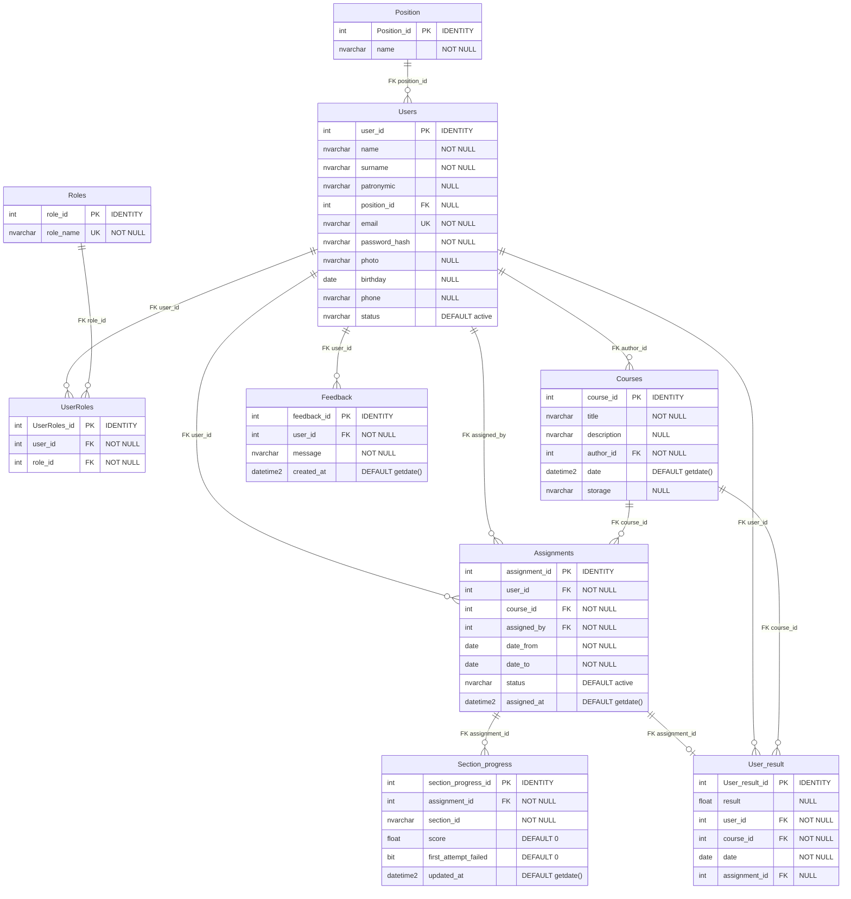

# Приложение Е. ER-диаграмма (физическая модель)

**Проект:** Адаптационный курс для сотрудников ритуальной компании  
**СУБД:** Microsoft SQL Server, база `LearningPlatformDB`  
**Нотация:** физическая ER-модель (PK / FK)  
**Версия:** 1.1  
**Дата:** июнь 2026

---

## Рисунок 4. Физическая ER-диаграмма базы данных

Диаграмма построена по стандарту физического моделирования: у каждой сущности указаны первичные (PK) и внешние (FK) ключи, типы связей 1:N и 1:1.

```mermaid
erDiagram
    Position ||--o{ Users : "FK position_id"
    Users ||--o{ UserRoles : "FK user_id"
    Roles ||--o{ UserRoles : "FK role_id"
    Users ||--o{ Courses : "FK author_id"
    Users ||--o{ Assignments : "FK user_id"
    Users ||--o{ Assignments : "FK assigned_by"
    Courses ||--o{ Assignments : "FK course_id"
    Assignments ||--o{ Section_progress : "FK assignment_id"
    Assignments ||--o| User_result : "FK assignment_id"
    Users ||--o{ User_result : "FK user_id"
    Courses ||--o{ User_result : "FK course_id"
    Users ||--o{ Feedback : "FK user_id"

    Position {
        int Position_id PK "IDENTITY"
        nvarchar name "NOT NULL"
    }

    Roles {
        int role_id PK "IDENTITY"
        nvarchar role_name UK "NOT NULL"
    }

    Users {
        int user_id PK "IDENTITY"
        nvarchar name "NOT NULL"
        nvarchar surname "NOT NULL"
        nvarchar patronymic "NULL"
        int position_id FK "NULL"
        nvarchar email UK "NOT NULL"
        nvarchar password_hash "NOT NULL"
        nvarchar photo "NULL"
        date birthday "NULL"
        nvarchar phone "NULL"
        nvarchar status "DEFAULT active"
    }

    UserRoles {
        int UserRoles_id PK "IDENTITY"
        int user_id FK "NOT NULL"
        int role_id FK "NOT NULL"
    }

    Courses {
        int course_id PK "IDENTITY"
        nvarchar title "NOT NULL"
        nvarchar description "NULL"
        int author_id FK "NOT NULL"
        datetime2 date "DEFAULT getdate()"
        nvarchar storage "NULL"
    }

    Assignments {
        int assignment_id PK "IDENTITY"
        int user_id FK "NOT NULL"
        int course_id FK "NOT NULL"
        int assigned_by FK "NOT NULL"
        date date_from "NOT NULL"
        date date_to "NOT NULL"
        nvarchar status "DEFAULT active"
        datetime2 assigned_at "DEFAULT getdate()"
    }

    Section_progress {
        int section_progress_id PK "IDENTITY"
        int assignment_id FK "NOT NULL"
        nvarchar section_id "NOT NULL"
        float score "DEFAULT 0"
        bit first_attempt_failed "DEFAULT 0"
        datetime2 updated_at "DEFAULT getdate()"
    }

    User_result {
        int User_result_id PK "IDENTITY"
        float result "NULL"
        int user_id FK "NOT NULL"
        int course_id FK "NOT NULL"
        date date "NOT NULL"
        int assignment_id FK "NULL"
    }

    Feedback {
        int feedback_id PK "IDENTITY"
        int user_id FK "NOT NULL"
        nvarchar message "NOT NULL"
        datetime2 created_at "DEFAULT getdate()"
    }
```

---

## Таблица связей

| Связь | Тип | FK | ON DELETE | Описание |
|-------|-----|-----|-----------|----------|
| Position → Users | 1:N | Users.position_id | — | Должность сотрудника |
| Users → UserRoles | 1:N | UserRoles.user_id | CASCADE | Роли пользователя |
| Roles → UserRoles | 1:N | UserRoles.role_id | CASCADE | Справочник ролей |
| Users → Courses | 1:N | Courses.author_id | — | Автор записи курса |
| Users → Assignments (user_id) | 1:N | Assignments.user_id | CASCADE | Назначенный сотрудник |
| Users → Assignments (assigned_by) | 1:N | Assignments.assigned_by | — | Эксперт-назначивший |
| Courses → Assignments | 1:N | Assignments.course_id | CASCADE | Курс в назначении |
| Assignments → Section_progress | 1:N | Section_progress.assignment_id | CASCADE | Прогресс по разделам |
| Assignments → User_result | 1:1 | User_result.assignment_id | — | Итог по назначению |
| Users → User_result | 1:N | User_result.user_id | CASCADE | Результаты сотрудника |
| Courses → User_result | 1:N | User_result.course_id | CASCADE | Результаты по курсу |
| Users → Feedback | 1:N | Feedback.user_id | CASCADE | Обратная связь |

---

## Уникальные ограничения

| Таблица | Ограничение | Назначение |
|---------|-------------|------------|
| Users | UQ(email) | Один email — одна учётная запись |
| Roles | UQ(role_name) | Уникальное имя роли |
| UserRoles | UQ(user_id, role_id) | Одна роль не дублируется у пользователя |
| Section_progress | UQ(assignment_id, section_id) | Один раздел — одна запись прогресса |

---

## Сущности вне БД (файловая модель)

Структура разделов и квизов **не хранится в таблицах**. Она описана в:

| Тип курса | Файл | Пример поля |
|-----------|------|-------------|
| Нативный | `course.json` | `sections[].id`, `weight`, `scorable` |
| SCORM 2004 | `imsmanifest.xml` | organization, resources |

Поле `Section_progress.section_id` ссылается на идентификатор из manifest, а не на FK в БД.

---

## Скрипт создания

Полный SQL-скрипт — в [Приложение_К_Скрипт_базы_данных.md](Приложение_К_Скрипт_базы_данных.md) и `backend/LearningPlatformDB.sql`.

---

## Примечание для переноса в Word

Вставьте диаграмму как **«Рисунок 4. Физическая ER-диаграмма базы данных LearningPlatformDB»**. При отрисовке в ERwin / draw.io используйте обозначения PK и FK, как на учебном примере физической модели.
