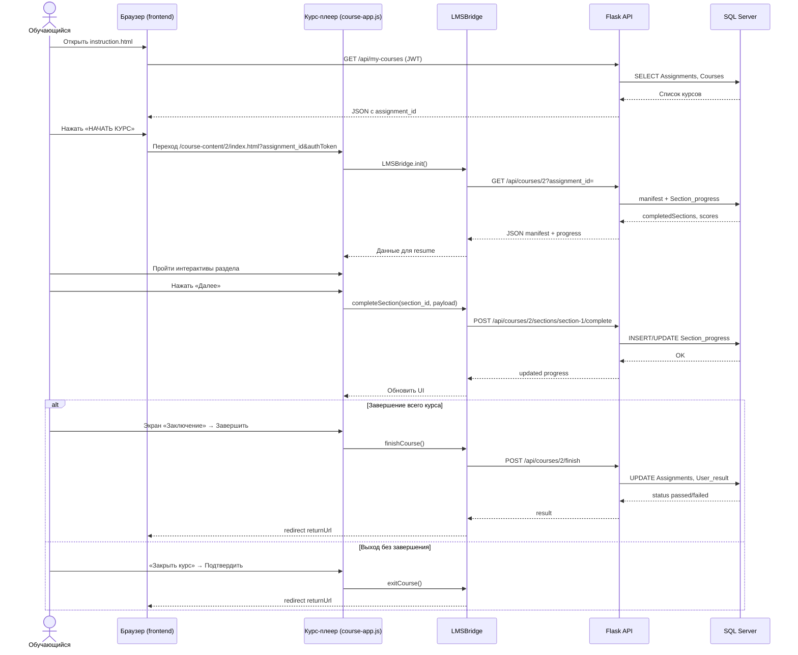
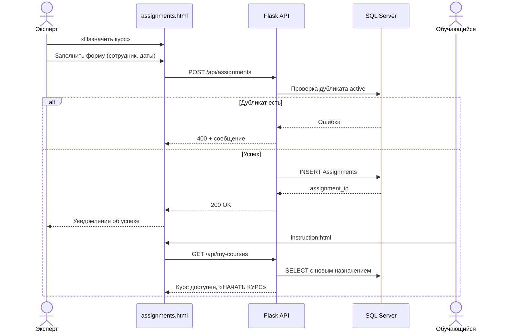
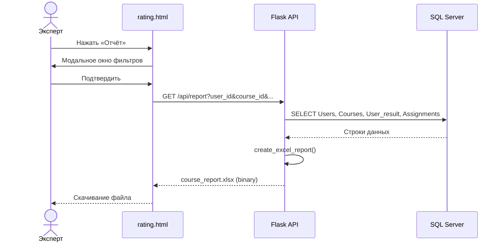

# Приложение З. Диаграмма последовательностей

**Проект:** Адаптационный курс для сотрудников ритуальной компании  
**Версия:** 1.0  
**Дата:** июнь 2026

---

## Рисунок 5. Диаграмма последовательностей — прохождение курса

**Сценарий:** обучающийся запускает нативный курс, проходит раздел и возвращается в LMS.

---

## Рисунок 6. Диаграмма последовательностей — назначение курса

**Сценарий:** эксперт назначает курс сотруднику.

---

## Рисунок 7. Диаграмма последовательностей — формирование отчёта

---

## Описание участников

| Участник | Назначение |
|----------|------------|
| Обучающийся / Эксперт | Конечный пользователь |
| Браузер (frontend) | HTML/JS страницы LMS на порту 8000 |
| Курс-плеер | index.html + course-app.js + course-interactions.js |
| LMSBridge | Мост между плеером и REST API |
| Flask API | backend/app.py на порту 5000 |
| SQL Server | Хранение Users, Assignments, Section_progress, User_result |

---

## Примечание для переноса в Word

Рекомендуемые подписи: «Рисунок 5. Прохождение курса», «Рисунок 6. Назначение курса», «Рисунок 7. Формирование отчёта».
