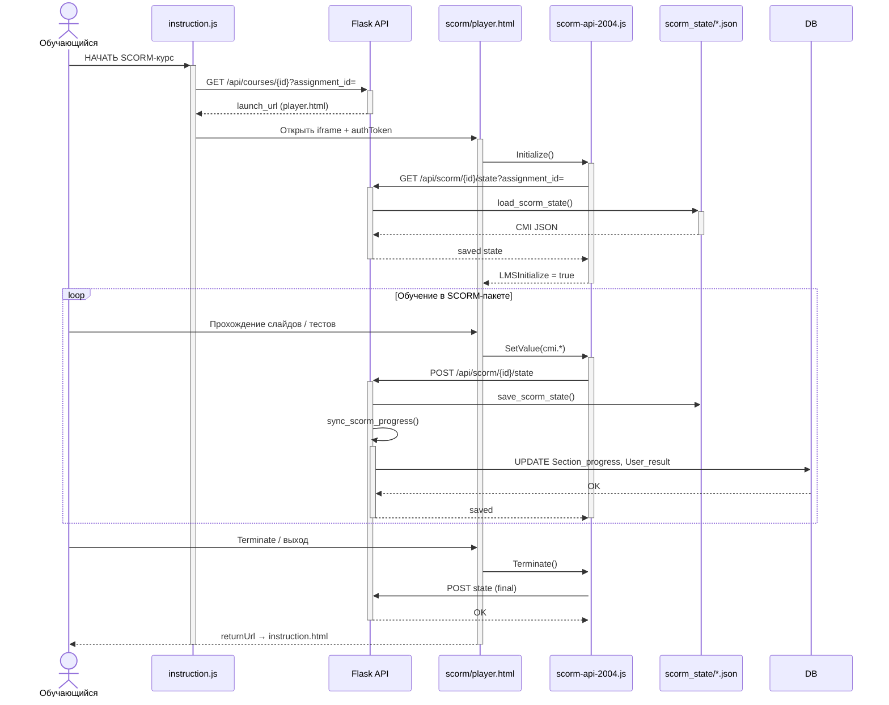
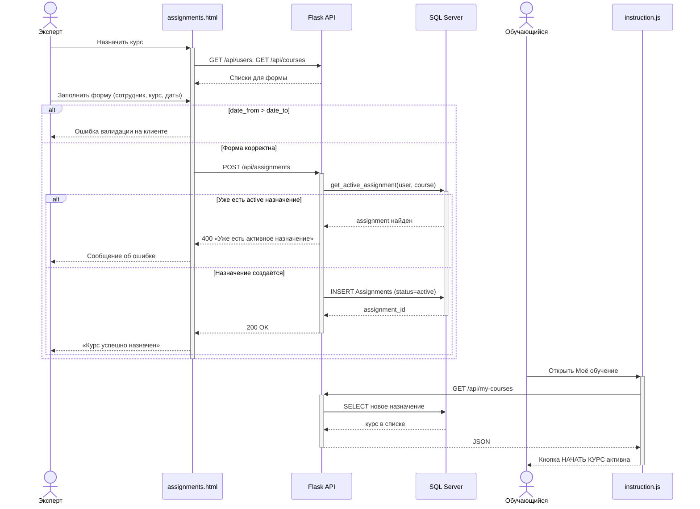
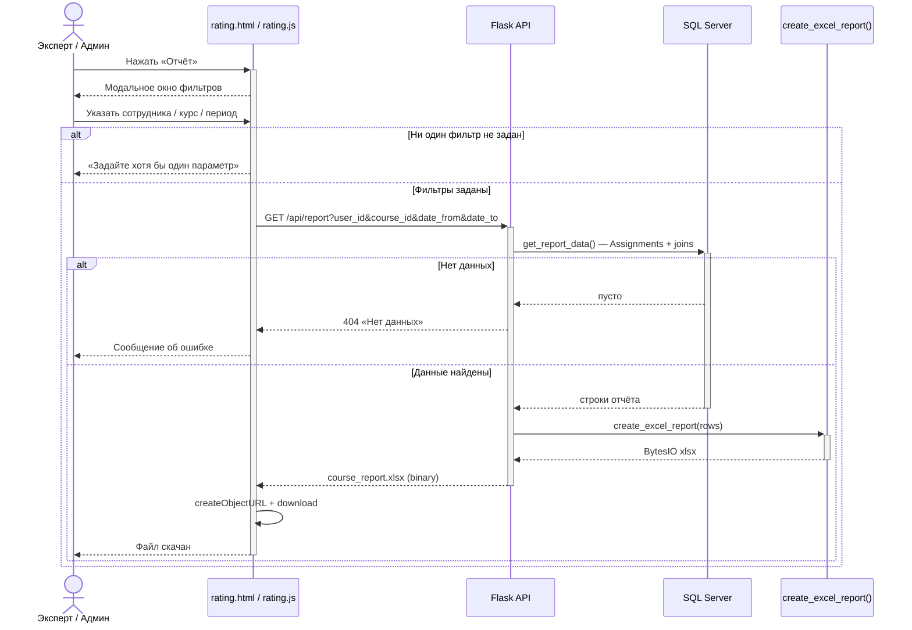
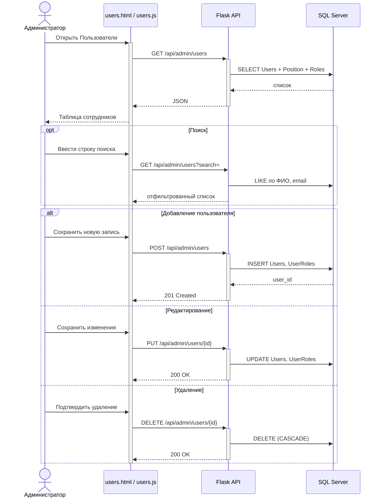
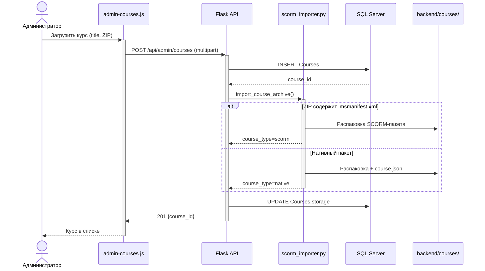
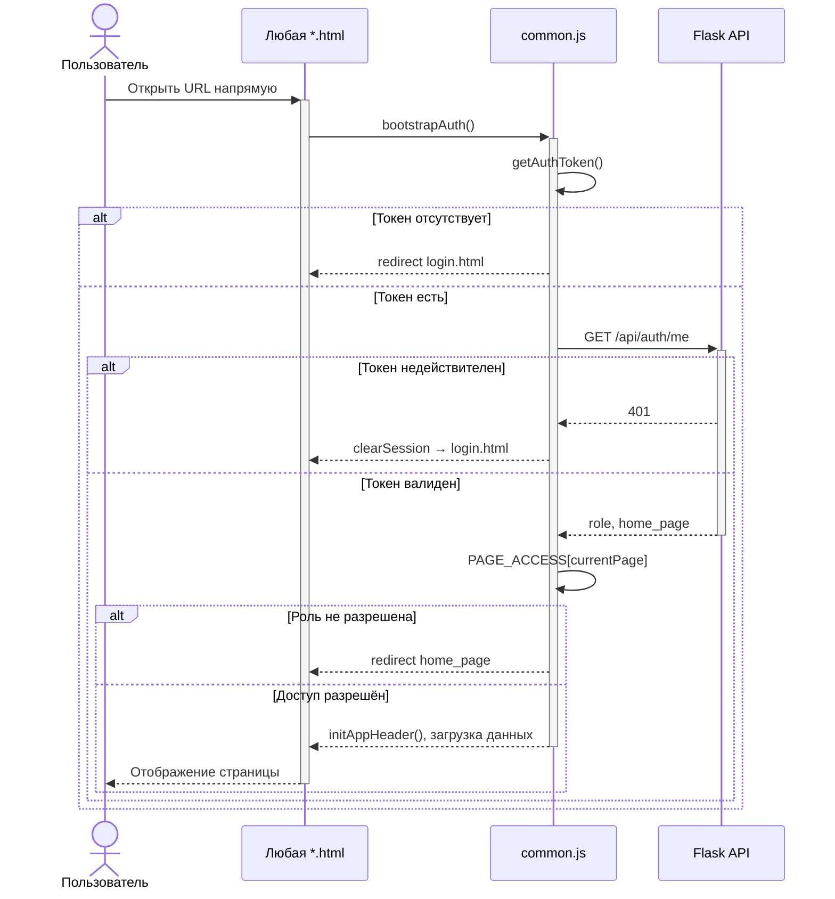

# Приложение З. Диаграммы последовательностей (UML)

**Проект:** Адаптационный курс для сотрудников ритуальной компании  
**Нотация:** UML 2.x Sequence Diagram  
**Версия:** 1.1  
**Дата:** июнь 2026

Диаграммы содержат **активации** (прямоугольники жизненного цикла), **основные** и **альтернативные** сценарии, фрагменты `alt` / `opt` / `loop`.

---

## Рисунок 5. Авторизация пользователя

```mermaid
sequenceDiagram
    actor User as Пользователь
    participant Login as login.html / auth.js
    participant API as Flask API
    participant DB as SQL Server

    User->>+Login: Ввести email и пароль
    Login->>Login: Проверка заполнения полей
    alt Поля пустые
        Login-->>User: Сообщение «Заполните поля»
        deactivate Login
    else Поля заполнены
        Login->>+API: POST /api/login {login, password}
        API->>+DB: SELECT Users, UserRoles, Roles
        DB-->>-API: user_id, role
        alt Неверные учётные данные
            API-->>Login: 401 Unauthorized
            Login-->>User: «Неверный логин или пароль»
        else Успешный вход
            API->>API: create_access_token(JWT)
            API-->>-Login: 200 {token, role, home_page}
            Login->>Login: sessionStorage ← token, role
            Login-->>-User: redirect home_page
        end
    end
```

---

## Рисунок 6. Прохождение нативного курса (полный сценарий)

```mermaid
sequenceDiagram
    actor Student as Обучающийся
    participant Inst as instruction.js
    participant API as Flask API
    participant DB as SQL Server
    participant Player as course-app.js
    participant Bridge as lms-bridge.js
    participant Inter as course-interactions.js

    Student->>+Inst: Открыть instruction.html
    Inst->>+API: GET /api/my-courses (JWT)
    API->>+DB: SELECT Assignments, Courses, User_result
    DB-->>-API: список назначений
    API-->>-Inst: JSON курсов
    Inst-->>Student: Карточка курса, прогресс %

    Student->>Inst: НАЧАТЬ КУРС
    Inst->>+API: GET /api/courses/{id}?assignment_id=
    API->>DB: Проверка assignment, manifest, Section_progress
    alt Нет активного назначения
        API-->>Inst: 403
        Inst-->>Student: Ошибка доступа
    else Доступ разрешён
        API-->>-Inst: launch_url, manifest, progress
        Inst->>Player: Переход launch_url + authToken

        Player->>+Bridge: LMSBridge.init()
        Bridge->>+API: GET /api/courses/{id}?assignment_id=
        API->>DB: SELECT Section_progress
        DB-->>API: completedSections
        API-->>-Bridge: manifest + progress
        Bridge-->>-Player: resume на последний экран

        loop Каждый экран курса
            Student->>Player: Просмотр контента
            Player->>+Inter: isGateReady()
            alt Интерактивы не решены
                Inter-->>Player: false — кнопка «Далее» заблокирована
                Student->>Inter: Решить quiz / flip / drag-drop
                Inter-->>-Player: gate ready
            end
            Student->>Player: Нажать «Далее»
            Player->>+Bridge: completeSection(section_id, payload)
            Bridge->>+API: POST .../sections/{id}/complete
            API->>+DB: INSERT/UPDATE Section_progress
            API->>DB: _recalculate_assignment_score → User_result
            DB-->>-API: total_score
            API-->>-Bridge: progress, total_score
            Bridge-->>-Player: Обновить UI прогресса
        end

        alt Завершение курса (экран «Заключение»)
            Student->>Player: Завершить курс
            Player->>+Bridge: finishCourse()
            Bridge->>+API: POST /api/courses/{id}/finish
            API->>DB: Проверка всех scorable-разделов
            API->>DB: UPDATE Assignments.status passed/failed
            API->>DB: Очистка Section_progress
            DB-->>API: итоговый балл
            API-->>-Bridge: {result, assignment_status}
            Bridge-->>-Player: redirect returnUrl
            Player-->>Student: instruction.html
        else Выход без завершения
            Student->>Player: Закрыть курс → Подтвердить
            Player->>+Bridge: exitCourse()
            Note over Bridge: Прогресс сохранён в Section_progress
            Bridge-->>-Player: redirect returnUrl
            Player-->>-Student: instruction.html
        end
    end
    deactivate Inst
```

---

## Рисунок 7. Прохождение SCORM-курса

```mermaid
sequenceDiagram
    actor Student as Обучающийся
    participant Inst as instruction.js
    participant API as Flask API
    participant Player as scorm/player.html
    participant SCORM as scorm-api-2004.js
    participant FS as scorm_state/*.json

    Student->>+Inst: НАЧАТЬ SCORM-курс
    Inst->>+API: GET /api/courses/{id}?assignment_id=
    API-->>-Inst: launch_url (player.html)
    Inst->>+Player: Открыть iframe + authToken

    Player->>+SCORM: Initialize()
    SCORM->>+API: GET /api/scorm/{id}/state?assignment_id=
    API->>+FS: load_scorm_state()
    FS-->>-API: CMI JSON
    API-->>-SCORM: saved state
    SCORM-->>-Player: LMSInitialize = true

    loop Обучение в SCORM-пакете
        Student->>Player: Прохождение слайдов / тестов
        Player->>+SCORM: SetValue(cmi.*)
        SCORM->>+API: POST /api/scorm/{id}/state
        API->>FS: save_scorm_state()
        API->>+API: sync_scorm_progress()
        API->>DB: UPDATE Section_progress, User_result
        DB-->>API: OK
        API-->>-SCORM: saved
        deactivate SCORM
    end

    Student->>Player: Terminate / выход
    Player->>+SCORM: Terminate()
    SCORM->>API: POST state (final)
    API-->>-SCORM: OK
    Player-->>-Student: returnUrl → instruction.html
    deactivate Inst
```

---

## Рисунок 8. Назначение курса экспертом

```mermaid
sequenceDiagram
    actor Expert as Эксперт
    participant UI as assignments.html
    participant API as Flask API
    participant DB as SQL Server
    actor Student as Обучающийся
    participant Inst as instruction.js

    Expert->>+UI: Назначить курс
    UI->>API: GET /api/users, GET /api/courses
    API-->>UI: Списки для формы
    Expert->>UI: Заполнить форму (сотрудник, курс, даты)

    alt date_from > date_to
        UI-->>Expert: Ошибка валидации на клиенте
    else Форма корректна
        UI->>+API: POST /api/assignments
        API->>+DB: get_active_assignment(user, course)
        alt Уже есть active назначение
            DB-->>API: assignment найден
            API-->>UI: 400 «Уже есть активное назначение»
            UI-->>Expert: Сообщение об ошибке
        else Назначение создаётся
            API->>DB: INSERT Assignments (status=active)
            DB-->>-API: assignment_id
            API-->>-UI: 200 OK
            UI-->>Expert: «Курс успешно назначен»
        end
    end
    deactivate UI

    Student->>+Inst: Открыть Моё обучение
    Inst->>+API: GET /api/my-courses
    API->>DB: SELECT новое назначение
    DB-->>API: курс в списке
    API-->>-Inst: JSON
    Inst-->>-Student: Кнопка НАЧАТЬ КУРС активна
```

---

## Рисунок 9. Формирование Excel-отчёта

```mermaid
sequenceDiagram
    actor Expert as Эксперт / Админ
    participant UI as rating.html / rating.js
    participant API as Flask API
    participant DB as SQL Server
    participant XLS as create_excel_report()

    Expert->>+UI: Нажать «Отчёт»
    UI-->>Expert: Модальное окно фильтров
    Expert->>UI: Указать сотрудника / курс / период
    alt Ни один фильтр не задан
        UI-->>Expert: «Задайте хотя бы один параметр»
    else Фильтры заданы
        UI->>+API: GET /api/report?user_id&course_id&date_from&date_to
        API->>+DB: get_report_data() — Assignments + joins
        alt Нет данных
            DB-->>API: пусто
            API-->>UI: 404 «Нет данных»
            UI-->>Expert: Сообщение об ошибке
        else Данные найдены
            DB-->>-API: строки отчёта
            API->>+XLS: create_excel_report(rows)
            XLS-->>-API: BytesIO xlsx
            API-->>-UI: course_report.xlsx (binary)
            UI->>UI: createObjectURL + download
            UI-->>-Expert: Файл скачан
        end
    end
```

---

## Рисунок 10. Управление пользователями (администратор)

```mermaid
sequenceDiagram
    actor Admin as Администратор
    participant UI as users.html / users.js
    participant API as Flask API
    participant DB as SQL Server

    Admin->>+UI: Открыть Пользователи
    UI->>+API: GET /api/admin/users
    API->>DB: SELECT Users + Position + Roles
    DB-->>API: список
    API-->>-UI: JSON
    UI-->>Admin: Таблица сотрудников

    opt Поиск
        Admin->>UI: Ввести строку поиска
        UI->>API: GET /api/admin/users?search=
        API->>DB: LIKE по ФИО, email
        API-->>UI: отфильтрованный список
    end

    alt Добавление пользователя
        Admin->>UI: Сохранить новую запись
        UI->>+API: POST /api/admin/users
        API->>DB: INSERT Users, UserRoles
        DB-->>API: user_id
        API-->>-UI: 201 Created
    else Редактирование
        Admin->>UI: Сохранить изменения
        UI->>+API: PUT /api/admin/users/{id}
        API->>DB: UPDATE Users, UserRoles
        API-->>-UI: 200 OK
    else Удаление
        Admin->>UI: Подтвердить удаление
        UI->>+API: DELETE /api/admin/users/{id}
        API->>DB: DELETE (CASCADE)
        API-->>-UI: 200 OK
    end
    deactivate UI
```

---

## Рисунок 11. Загрузка курса администратором

```mermaid
sequenceDiagram
    actor Admin as Администратор
    participant UI as admin-courses.js
    participant API as Flask API
    participant Imp as scorm_importer.py
    participant DB as SQL Server
    participant Disk as backend/courses/

    Admin->>+UI: Загрузить курс (title, ZIP)
    UI->>+API: POST /api/admin/courses (multipart)
    API->>+DB: INSERT Courses
    DB-->>API: course_id
    API->>+Imp: import_course_archive()
    alt ZIP содержит imsmanifest.xml
        Imp->>Disk: Распаковка SCORM-пакета
        Imp-->>API: course_type=scorm
    else Нативный пакет
        Imp->>Disk: Распаковка + course.json
        Imp-->>-API: course_type=native
    end
    API->>DB: UPDATE Courses.storage
    API-->>-UI: 201 {course_id}
    UI-->>-Admin: Курс в списке
```

---

## Рисунок 12. Проверка прав доступа к странице

```mermaid
sequenceDiagram
    actor User as Пользователь
    participant Page as Любая *.html
    participant Common as common.js
    participant API as Flask API

    User->>+Page: Открыть URL напрямую
    Page->>+Common: bootstrapAuth()
    Common->>Common: getAuthToken()
    alt Токен отсутствует
        Common-->>Page: redirect login.html
    else Токен есть
        Common->>+API: GET /api/auth/me
        alt Токен недействителен
            API-->>Common: 401
            Common-->>Page: clearSession → login.html
        else Токен валиден
            API-->>-Common: role, home_page
            Common->>Common: PAGE_ACCESS[currentPage]
            alt Роль не разрешена
                Common-->>Page: redirect home_page
            else Доступ разрешён
                Common-->>-Page: initAppHeader(), загрузка данных
                Page-->>-User: Отображение страницы
            end
        end
    end
```

---

## Участники (легенда)

| Участник | Реализация |
|----------|------------|
| login.html / auth.js | `frontend/login.html`, `auth.js` |
| instruction.js | `frontend/instruction.js` |
| assignments.html | `frontend/assignments.js` |
| rating.html | `frontend/rating.js` |
| users.html | `frontend/users.js` |
| course-app.js | `backend/courses/bezopasnost/course-app.js` |
| lms-bridge.js | `backend/courses/bezopasnost/lms-bridge.js` |
| Flask API | `backend/app.py` |
| SQL Server | `LearningPlatformDB` |

---

## Примечание для переноса в Word

Экспортируйте каждую диаграмму как отдельный рисунок (Рисунки 5–12). В Visio / draw.io при ручной отрисовке обязательно показывайте **активации** на линиях жизни (узкие прямоугольники), как в ГОСТ-примере телефонного звонка.
