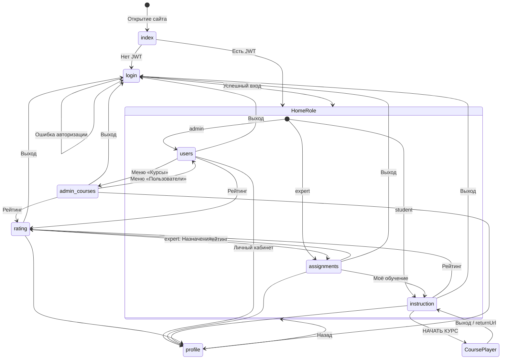

# Приложение Л. Реализация программного обеспечения

**Проект:** Адаптационный курс для сотрудников ритуальной компании  
**Версия:** 1.1  
**Дата:** июнь 2026

---

## 1. Общие архитектурные решения

| Решение | Реализация | Обоснование |
|---------|------------|-------------|
| Разделение frontend/backend | Статика на порту 8000, API на 5000 | Упрощает развёртывание учебного проекта; курс открывается с backend для единого origin SCORM |
| Без SPA-фреймворка | HTML + vanilla JS | Минимальные зависимости, прозрачная структура для курсовой |
| Авторизация | JWT (Flask-JWT-Extended, 12 ч) | Stateless API; токен в `sessionStorage`, передаётся в курс через query |
| Доступ к курсу | Только при активном `Assignments` | Исключает несанкционированное прохождение без назначения эксперта |
| Структура курса | Файлы (`course.json`, HTML), не БД | Гибкая загрузка SCORM и нативных пакетов без миграций схемы |
| Прогресс | `Section_progress` + `User_result` | Пошаговое сохранение и итоговый балл для рейтинга и отчётов |
| Расчёт баллов | `course_progress.py` (чистые функции) | Тестируемость без БД (`test_course_progress.py`) |

---

## 2. Карта экранов и переходов

**Рисунок Л-1. Диаграмма активности — навигация по окнам LMS**



Контроль доступа к страницам — константа `PAGE_ACCESS` в `frontend/common.js`: при несовпадении роли выполняется редирект на `homePage`.

---

## 3. Реализация по экранам

### 3.1. `index.html` — точка входа

| Элемент | Код | Назначение |
|---------|-----|------------|
| Проверка сессии | `app.js` → `bootstrapAuth()` | Ожидание JWT, редирект |
| Редирект | `common.js` `getHomePage()` | На страницу роли или `login.html` |

**Переходы:** нет токена → `login.html`; есть токен → `users.html` / `assignments.html` / `instruction.html`.

**Обоснование:** единая точка входа вместо прямых закладок на `login.html`.

---

### 3.2. `login.html` — авторизация

| Функция | Файл | API |
|---------|------|-----|
| Отправка формы | `auth.js` | `POST /api/login` |
| Сохранение сессии | `common.js` `saveAuthSession()` | `sessionStorage`: token, role, homePage |

```javascript
// auth.js — фрагмент
const response = await fetch(`${API_URL}/login`, {
    method: 'POST',
    headers: { 'Content-Type': 'application/json' },
    body: JSON.stringify({ login: email, password })
});
```

**Backend:** `app.py` → `db.authenticate_user()` → `create_access_token(identity={user_id, role})`.

**Альтернативные сценарии:**
- Неверный пароль → сообщение об ошибке, остаёмся на `login.html`;
- Пустые поля → валидация на клиенте.

**Обоснование:** JWT вместо серверных сессий — проще для REST и передачи `authToken` в URL курса.

---

### 3.3. `instruction.html` — «Моё обучение»

| Функция | Файл | API / логика |
|---------|------|--------------|
| Загрузка курсов | `instruction.js` | `GET /api/my-courses` |
| Отображение карточки | `instruction.js` | progress_percent, date_from/date_to |
| Запуск курса | `instruction.js` | `GET /api/courses/{id}?assignment_id=` → `launch_url` |

```javascript
// instruction.js — запуск
const data = await response.json();
window.location.href = data.launch_url; // /course-content/2/index.html?assignment_id&authToken&returnUrl
```

**Переходы:** шапка → `rating.html`, `profile.html`; кнопка «НАЧАТЬ КУРС» → плеер на :5000.

**Альтернативы:**
- Нет назначений → текст «Курсы не назначены»;
- `has_storage = false` → кнопка неактивна;
- `assignment_status != active` после завершения → курс недоступен для продолжения.

**Обоснование:** список строится только из `Assignments`, а не из всего каталога — обучающийся видит только своё.

---

### 3.4. `assignments.html` — назначения (эксперт)

| Функция | Файл | API |
|---------|------|-----|
| Список курсов | `assignments.js` | `GET /api/courses` |
| Модальное окно назначения | `assignments.js` | `GET /api/users`, `GET /api/courses` |
| Создание назначения | `assignments.js` | `POST /api/assignments` |
| Статистика | `assignments.js` | `rating.html?report=1&course_id=` |

```python
# database.py — create_assignment
active = self.get_active_assignment(user_id, course_id)
if active:
    return None, 'У пользователя уже есть активное назначение по этому курсу'
```

**Модальные окна:** форма назначения (сотрудник, курс, date_from, date_to).

**Альтернативы:** дубликат active → 400; date_from > date_to → валидация на клиенте; незаполненные поля → ошибка формы.

**Обоснование:** одно активное назначение на пару (user, course) предотвращает путаницу в прогрессе.

---

### 3.5. `rating.html` — рейтинг и отчёт

| Функция | Файл | API |
|---------|------|-----|
| Таблица рейтинга | `rating.js` | `GET /api/rating` |
| Кнопка «Отчёт» | `rating.js` | видна только expert/admin (`isExpertOrAdmin()`) |
| Модальное окно отчёта | `rating.js` | `GET /api/report?...` → blob → download |
| Подтверждение отмены | `rating.js` | `cancelConfirmModal` |

**Столбцы Excel:** формирует `create_excel_report()` в `app.py` из `get_report_data()`.

**Обоснование:** отчёт привязан к рейтингу (extend UC-11 → UC-03); фильтры необязательны, но хотя бы один параметр обязателен.

---

### 3.6. `users.html` — пользователи (админ)

| Функция | Файл | API |
|---------|------|-----|
| Список + поиск | `users.js` | `GET /api/admin/users?search=` |
| CRUD | `users.js` | POST/PUT/DELETE `/api/admin/users` |
| Справочники | `users.js` | `GET /api/admin/positions`, `/api/admin/roles` |
| Фото | `users.js` | `POST /api/admin/users/{id}/photo` |

**Модальные окна:** добавление, редактирование, подтверждение удаления.

**Обоснование:** серверный поиск (`LIKE` в `get_all_users`) — масштабируемость при росте числа сотрудников.

---

### 3.7. `admin-courses.html` — каталог курсов (админ)

| Функция | Файл | API |
|---------|------|-----|
| Список курсов | `admin-courses.js` | `GET /api/courses` |
| Загрузка ZIP | `admin-courses.js` | `POST /api/admin/courses` (multipart) |
| Редактирование | `admin-courses.js` | `PUT /api/admin/courses/{id}` |
| Скачивание | `admin-courses.js` | `GET .../download` |
| Удаление | `admin-courses.js` | `DELETE ...` + `purge_course_data()` |

**Backend:** `import_course_archive()` определяет SCORM по `imsmanifest.xml`.

**Обоснование:** единая точка загрузки native и SCORM без отдельных форм.

---

### 3.8. `profile.html` — личный кабинет

| Функция | Файл | API |
|---------|------|-----|
| Просмотр/редактирование | `profile.js` | `GET/PUT /api/profile` |
| Фото | `profile.js` | `POST /api/profile/photo` |

**Ограничение:** эксперт не может редактировать профиль через API (`app.py` возвращает 403 на PUT для expert).

---

### 3.9. Нативный курс-плеер (`bezopasnost/`)

| Компонент | Файл | Ответственность |
|-----------|------|-----------------|
| Экраны | `index.html` | 10 экранов (splash → conclusion) |
| Манифест | `course.json` | section_id, веса, scorable |
| Навигация | `course-app.js` | gating «Далее», содержание, resume |
| Интерактивы | `course-interactions.js` | quiz, flip, slider, drag-drop |
| LMS-мост | `lms-bridge.js` | init, completeSection, finishCourse, exitCourse |

**Gating:** `CourseInteractions.isGateReady()` блокирует «Далее» до решения всех `data-quiz` на экране.

**Обоснование:** декларативные `data-*` атрибуты — контент отделён от логики проверки.

---

## 4. Серверные модули

| Модуль | Ключевые функции | Зачем выделен |
|--------|------------------|---------------|
| `app.py` | Маршруты, JWT, Excel | Точка входа HTTP |
| `database.py` | CRUD, assignments, progress | Единый слой данных |
| `course_progress.py` | `PASS_THRESHOLD`, `calculate_section_score` | Тестируемая бизнес-логика |
| `course_manifest.py` | `load_course_manifest`, `is_scorable_section` | Чтение `course.json` |
| `scorm_importer.py` | Импорт ZIP | Админ-загрузка |
| `scorm_runtime.py` | CMI state JSON | SCORM без изменения схемы БД |
| `file_uploads.py` | Фото пользователей | Изоляция файловых операций |

---

## 5. Таблица соответствия: функция → код

| Функция системы | Frontend | Backend | БД |
|-----------------|----------|---------|-----|
| Вход | `auth.js` | `POST /api/login` | `Users`, `UserRoles` |
| Назначение курса | `assignments.js` | `POST /api/assignments` | `Assignments` |
| Список моих курсов | `instruction.js` | `GET /api/my-courses` | `Assignments`, `Courses` |
| Завершение раздела | `lms-bridge.js` | `POST .../complete` | `Section_progress`, `User_result` |
| Завершение курса | `lms-bridge.js` | `POST .../finish` | `Assignments.status`, `User_result` |
| SCORM прогресс | `scorm-api-2004.js` | `GET/POST /api/scorm/.../state` | JSON + `Section_progress` |
| Рейтинг | `rating.js` | `GET /api/rating` | `User_result` агрегация |
| Excel-отчёт | `rating.js` | `GET /api/report`, `create_excel_report` | `Assignments` + joins |
| CRUD пользователей | `users.js` | `/api/admin/users` | `Users`, `UserRoles` |
| Загрузка курса | `admin-courses.js` | `POST /api/admin/courses` | `Courses` + файлы |

---

## 6. Диаграммы UML (ссылки)

| Диаграмма | Документ |
|-----------|----------|
| IDEF0 | [Приложение_Г_IDEF0.md](Приложение_Г_IDEF0.md) |
| Use Case | [Приложение_Д_Use_Case.md](Приложение_Д_Use_Case.md) |
| ER (физическая) | [Приложение_Е_ER_диаграмма.md](Приложение_Е_ER_диаграмма.md) |
| Последовательности | [Приложение_З_Диаграмма_последовательностей.md](Приложение_З_Диаграмма_последовательностей.md) |
| Классы | [Приложение_М_Диаграмма_классов.md](Приложение_М_Диаграмма_классов.md) |
| Компоненты | [Приложение_Н_Диаграмма_компонентов.md](Приложение_Н_Диаграмма_компонентов.md) |

---

## Примечание для переноса в Word

Вставьте как **«Приложение Л. Реализация программного обеспечения»**. Таблицы и фрагменты кода — моноширинный шрифт.
