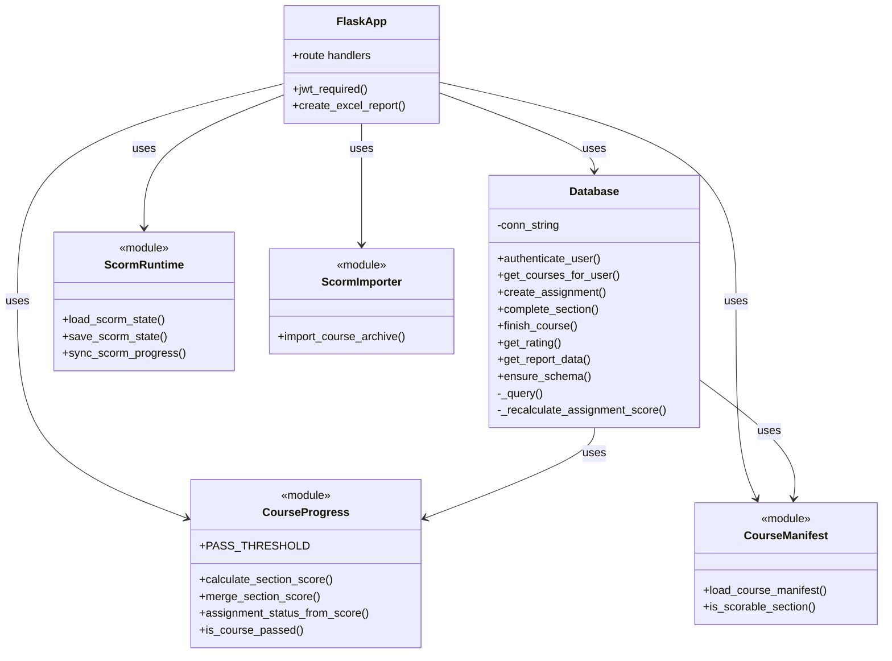
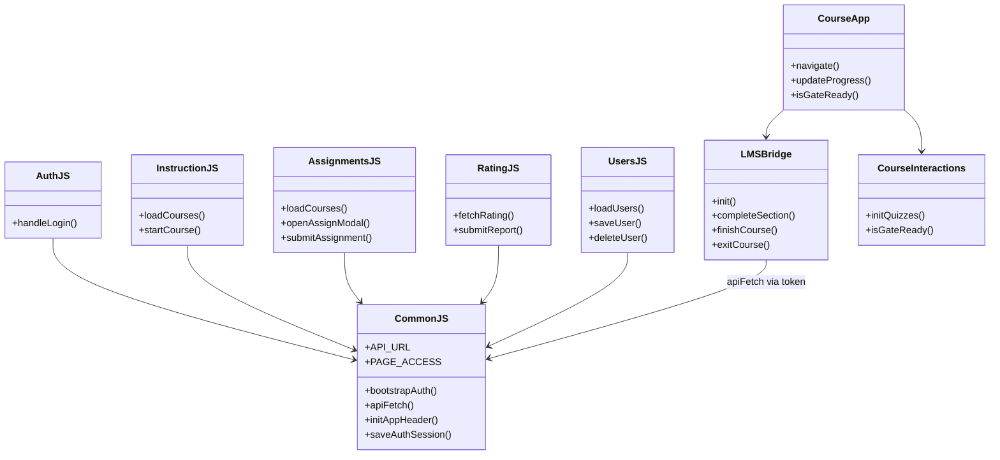
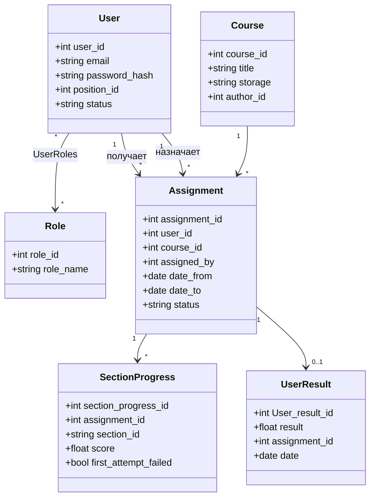

# Приложение М. Диаграмма классов (UML)

**Проект:** Адаптационный курс для сотрудников ритуальной компании  
**Нотация:** UML Class Diagram  
**Версия:** 1.0  
**Дата:** июнь 2026

---

## Рисунок М-1. Диаграмма классов серверной части

---

## Рисунок М-2. Диаграмма классов клиентской части

---

## Рисунок М-3. Доменные сущности (соответствие таблицам БД)

---

## Обоснование структуры классов

| Решение | Обоснование |
|---------|-------------|
| Один класс `Database` | Учебный проект; все SQL в одном месте, без ORM |
| Модули `course_progress`, `course_manifest` | Разделение чистой логики и I/O |
| `LMSBridge` отдельно от `CourseApp` | Плеер курса может работать автономно при тестировании |
| `CommonJS` как общий слой | DRY для auth и fetch на всех страницах LMS |

---

## Примечание для переноса в Word

Вставьте как **«Приложение М. Диаграмма классов»**, рисунки М-1 — М-3.
