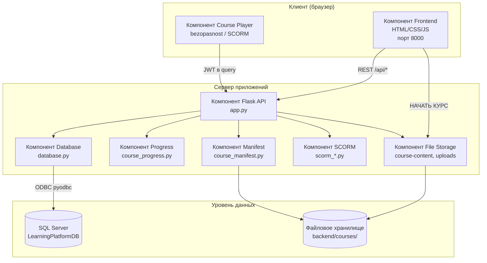
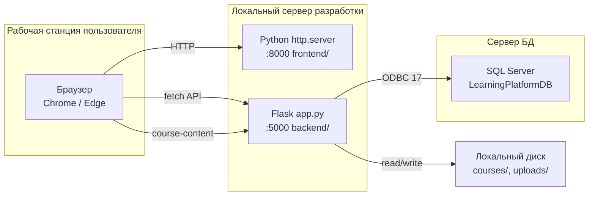

# Приложение Н. Диаграмма компонентов и развёртывания (UML)

**Проект:** Адаптационный курс для сотрудников ритуальной компании  
**Нотация:** UML Component / Deployment Diagram  
**Версия:** 1.0  
**Дата:** июнь 2026

---

## Рисунок Н-1. Диаграмма компонентов

---

## Рисунок Н-2. Диаграмма развёртывания

---

## Таблица компонентов

| Компонент | Файлы | Интерфейс | Зависимости |
|-----------|-------|-----------|-------------|
| Frontend | `frontend/*.html`, `*.js` | HTTP к :5000/api | — |
| Flask API | `app.py` | REST JSON, binary xlsx | Database, JWT |
| Database | `database.py` | Python methods | pyodbc, SQL Server |
| Course Player | `bezopasnost/*` | LMSBridge → REST | Flask API |
| SCORM Runtime | `scorm/*`, `scorm_runtime.py` | SCORM 2004 API | JSON state files |
| File Storage | `courses/`, `uploads/` | send_file | OS filesystem |

---

## Порты и протоколы

| Сервис | Порт | Протокол | Назначение |
|--------|------|----------|------------|
| Frontend | 8000 | HTTP | Статика LMS |
| Backend API | 5000 | HTTP/REST | JSON, JWT, файлы курсов |
| SQL Server | 1433* | TDS/ODBC | База данных |

\* Порт зависит от конфигурации экземпляра SQL Server.

---

## Примечание для переноса в Word

Вставьте как **«Приложение Н. Диаграмма компонентов и развёртывания»**.
